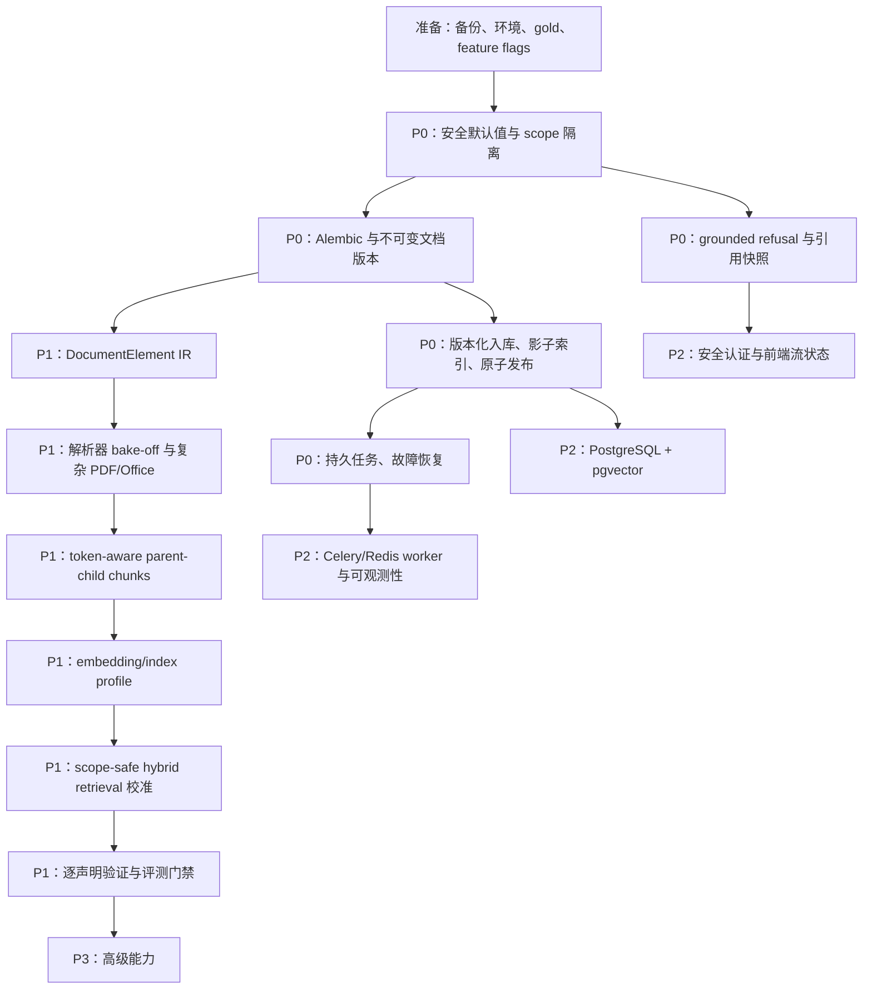
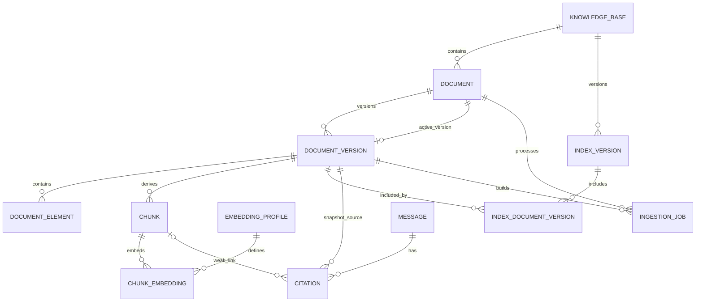

# RAG 系统分级优化实施方案

> 制定日期：2026-08-16  
> 适用代码基线：`E:\GPT-Codex\LangChainRAG` 当前工作树  
> 前置审计：`RAG-SYSTEM-AUDIT-REPORT.md`  
> 目标：把当前“强内部 Alpha”逐步升级为可评测、可回滚、可审计、可生产运行的 RAG 系统

---

## 1. 如何使用这份方案

这份方案不是一个可以随意挑选的功能清单，而是一条有依赖关系的改造路径。建议每次只领取一个工作包，创建独立分支，完成该包的测试和验收门槛后再进入下一包。

优先级定义：

| 层级 | 含义 | 是否允许跳过 |
|---|---|---|
| 准备层 | 备份、可复现环境、评测基线、feature flag | 不允许；否则无法证明优化有效，也无法安全回滚 |
| P0 | 数据隔离、数据不丢失、安全默认值、可信回答 | 上线前绝对不允许跳过 |
| P1 | 文件解析、切片、索引和检索质量的核心重构 | 扩大用户/文档规模前必须完成 |
| P2 | 生产工程、可观测性、前端可靠性、性能与运维 | 正式生产前完成，部分可与 P1 后半段并行 |
| P3 | 高阶产品能力、智能路由、知识图谱等 | P0/P1 指标稳定后再做 |

实施时必须遵守四条原则：

1. **先扩展，后迁移，最后删除。** 新字段/新表先以 nullable 或旁路方式加入，完成回填和双读验证后才删除旧路径。
2. **新旧版本并存。** 解析、切片、索引和 prompt 都必须有版本号；任何批量重建不得覆盖最后一个可用版本。
3. **先建立 gold，再宣称提升。** 不能以“看起来回答更好”作为完成标准。
4. **默认失败安全。** 解析器失败保留旧版；索引发布失败不切换；证据不足拒答；校验器失败不能自动把答案视为可信。

### 1.1 推荐人员与总体工期

以下估算以“一名熟悉 Python/React/数据库的全栈工程师”为口径，不包含等待 GPU、模型 API 或人工标注的时间：

| 阶段 | 单人估算 | 主要产物 |
|---|---:|---|
| 准备层 | 3–5 天 | 可重建环境、备份、初版 gold、基准脚本 |
| P0 | 3–5 周 | 数据隔离、版本化入库、可信拒答、安全底线 |
| P1 | 5–8 周 | 新解析 IR、parent-child 切片、结构化表格、校准检索 |
| P2 | 4–6 周 | PostgreSQL/worker/可观测/部署/前端测试与可靠性 |
| P3 | 持续迭代 | 高阶产品功能 |

若由后端、文档 AI、前端/测试三人并行，在接口冻结后可缩短到约 7–10 周。不要用工期压力取消迁移、回滚或评测环节。

---

## 2. 总体依赖顺序



可以并行的内容：

- P0 scope 隔离与安全默认值可以并行。
- gold 数据标注可以贯穿整个 P0/P1。
- 前端 requestId 修复可以与后端数据模型迁移并行，但 SSE 协议需先冻结。
- 解析器 bake-off 可以在版本化入库开发期间离线进行，但不能直接覆盖生产数据。

不能倒置的内容：

- 未完成数据备份和版本化前，不得批量重解析全部文档。
- 未完成统一 IR 前，不得继续堆叠第三套切片正则。
- 未获得检索 gold 指标前，不得根据主观感觉调 evidence 阈值。
- 未完成引用快照前，不得继续依赖可删除 chunk 作为历史审计依据。

### 2.1 唯一执行顺序总表

同一批次内可以并行；批次之间默认按从上到下执行。后文工作包编号表示分类，不表示可以绕过此表的依赖。

| 批次 | 必做工作包 | 目的 | 前置/退出条件 |
|---:|---|---|---|
| 0 | PRE-1、PRE-2、PRE-3 | 基线、备份、可复现环境、开关 | 恢复演练成功，测试/构建可执行 |
| 1 | PRE-4 持续；P0-1 先完成默认 secret/admin 止血 | 建首批 gold，堵住直接接管风险 | production 错误配置启动失败 |
| 2 | P0-2、P0-3、P0-4 | scope 隔离、停危险复用、无证据拒答 | 跨库 0 泄露，实时问题 100% 拒答 |
| 3 | P0-10 基础上传隔离和调试数据清理 | 防文件/隐私立即风险 | 恶意基础样本阻断，转储受控 |
| 4 | P0-6 | Alembic 基线 | 旧 SQLite/空库升级测试通过 |
| 5 | P0-7、P0-5 schema expand | 正确 chunk/cache 身份、引用快照 | 双写/回填 count 校验通过 |
| 6 | P0-8 | 不可变文档/索引版本和原子发布 | 故障时旧 active 100% 可用 |
| 7 | P0-9 | 持久 job、幂等、恢复/取消 | worker kill/重复投递测试通过 |
| 8 | P1-1；并行 P1-2 离线实验 | 统一 IR 和 parser 选型依据 | IR validator/snapshot 与 bake-off 报告 |
| 9 | P1-3、P1-4、P1-5 | PDF/Office 保真和安全清洗 | 扫描/Excel 关键 gold 达标 |
| 10 | P1-6、P1-7 | parent-child chunk 与 embedding profile | chunk/fact coverage/维度门禁通过 |
| 11 | P1-8 shadow、P1-9 | pgvector 对照与 retrieval v2 | exact/ANN/Recall/coverage/scope 达标 |
| 12 | P1-10、P1-11 | 回答编排、引用校验、持续评测 | factual/citation/refusal release gate |
| 13 | P2-1、P2-2、P2-3 | PG 正式迁移、worker、可观测 | 恢复/并发/readiness/trace 通过 |
| 14 | P2-4、P2-5、P2-10 | 部署、灾备、供应链和安全 | 安全高危 0，灾备演练成功 |
| 15 | P2-6、P2-7、P2-8 | 前端流状态、管理端、测试/性能 | E2E/竞态/bundle/a11y 门禁通过 |
| 16 | P2-9 | 正确性稳定后的性能优化 | SLO、成本和负载报告通过 |
| 17 | P3 按业务价值单项立项 | 高阶能力 | 每项必须绑定已测指标和独立回滚 |

---

## 3. 目标技术栈

### 3.1 保留的技术

| 技术 | 决定 | 原因 |
|---|---|---|
| FastAPI + async SQLAlchemy | 保留 | 当前模块边界清楚，适合 API 和异步外部调用 |
| React + TypeScript + Ant Design | 保留 | 产品界面已经成型，没有重写收益 |
| BGE-M3 + cross-encoder reranker | 作为基线保留 | 选型合理，但参数必须由领域评测校准 |
| PyMuPDF | 保留为干净文本层快速通道 | 速度快、易获得 bbox，不适合独自承担复杂布局 |
| LangChain | 保留薄封装 | 可继续用于模型适配/文本处理，不让它承载业务状态机 |

### 3.2 新增或替换的技术

| 能力 | 主选 | 备选/过渡 | 不建议 |
|---|---|---|---|
| 依赖与运行环境 | `pyproject.toml` + `uv.lock`；主 API Python 3.11；OCR worker 单独镜像 | pip-tools | 继续依赖本地 `.venv` 或裸 `requirements>=` |
| 数据库迁移 | Alembic | 无 | 在应用启动时执行手写 PRAGMA/ALTER |
| 生产数据库 | PostgreSQL 17，部署时固定镜像 digest | SQLite 仅开发/单机 | 宣称仅改 URL 即支持 PG/MySQL |
| 向量存储 | pgvector；先 exact，后按基准启用 HNSW | P0 过渡期使用版本化 Chroma collection | 每次文档更新 reset 全集合 |
| 后台任务 | Celery 5.6 + Redis 7.x；DB job 表为真相源 | 小规模过渡期 DB worker polling | 进程内 `asyncio.create_task` |
| 复杂中文扫描件 | PP-StructureV3 与 MinerU bake-off 后择优 | Docling 第三基线；RapidOCR 仅字符基线 | 把普通 PaddleOCR 当 PP-Structure 使用 |
| 评测 | 自定义 deterministic gold + Ragas 辅助 | 人工双盲复核 | 只看点赞率或 LLM 自评 |
| 可观测性 | OpenTelemetry + Prometheus/Grafana；结构化日志 | Sentry 作为异常聚合补充 | 只打印字符串日志 |
| 前端测试 | Vitest + React Testing Library + MSW；Playwright E2E | 无 | 只依赖人工点击 |

说明：解析器不要在方案阶段拍脑袋确定最终赢家。PP-StructureV3、MinerU、Docling 必须用本项目的中文扫描规范、旋转页和 Excel/Word 样本做同条件测试。最终选的是“在你的文档上得分最高且成本可接受的方案”，不是网络热度最高的方案。

---

## 4. 准备层：任何业务重构前先完成

### PRE-1 冻结基线、备份和恢复演练

**目标**：确保任何迁移失败都能回到当前可运行状态。

**涉及位置**：

- `backend/data/app.db`
- `backend/data/.chroma`
- `backend/data/uploads`
- `backend/.env`
- 当前 Git 工作树中的未提交改动

**具体步骤**：

1. 创建一个只包含当前代码的 Git 分支，例如 `codex/baseline-before-rag-v2`；先人工确认并提交当前用户已有改动。
2. 停止后端写入后再备份 SQLite：优先执行 SQLite online backup 或 `.backup`，不要只在 WAL 活跃时复制单个 `app.db`。
3. 将 `app.db`、`-wal/-shm` 一致性处理后的备份、`.chroma`、uploads 分别归档；计算 SHA-256，写入 manifest。
4. 备份 `.env` 时单独加密并限制访问，普通归档不得包含 API key/JWT secret。
5. 在一个空临时目录执行恢复：启动只读副本，核对 11 KB、12 documents、1242 chunks、1242 vectors 等当前基线数量。
6. 输出 `scripts/backup.ps1`、`scripts/restore.ps1` 或跨平台 Python CLI，但生产环境最终应由数据库/对象存储备份工具接管。
7. 定义数据保留：每日增量、每周全量；至少保留最近 7 个日备份和 4 个周备份。

**测试**：

- 原数据库损坏/移走后，仅通过备份恢复并成功查询一个已有问答。
- 恢复后 DB chunk 数与向量数一致，随机抽 20 个 chunk 均可按 ID 找到。
- 恢复演练所需时间有记录。

**完成标准**：RTO/RPO 首个目标可设为 RTO ≤ 2 小时、RPO ≤ 24 小时；在没有真实恢复演练前不得标记完成。

### PRE-2 重建可复现开发环境

**目标**：解决当前 `.venv` 指向已删除 Python 3.10、依赖无锁和 `.npmrc` 机器路径问题。

**新增/修改**：

- 新增根 `pyproject.toml` 或 `backend/pyproject.toml`
- 新增 `uv.lock`
- 调整 `backend/requirements.txt` 为导出物或删除双源
- 删除机器专属 `.npmrc` shell 配置
- 新增 `.python-version`
- 更新 `deploy/Dockerfile` 与 CI

**具体步骤**：

1. 主 API 选择 Python 3.11；复杂 OCR 依赖放在独立 optional group/worker 镜像，避免 Paddle/CUDA 约束污染 Web 镜像。
2. 将依赖拆为：`api`、`worker`、`parsers-paddle`、`parsers-mineru`、`dev`、`eval`。
3. 用 `uv lock` 固定完整传递依赖；CI 使用 `uv sync --frozen`。
4. 不提交 `.venv`；从零创建环境并运行 `pytest --collect-only` 与全部离线测试。
5. 前端只使用 `npm ci`；移除硬编码 Git Bash；补 `engines` 和 Node 版本文件。
6. CI 在 Windows 与 Linux 至少各执行一次后端离线测试和前端 build，避免再次引入本机路径。

**验收**：全新目录在没有旧 `.venv/node_modules` 的情况下，一条文档化命令可安装、收集 239 个测试并构建前端。

### PRE-3 建立 feature flags 和配置校验

**目标**：所有高风险新链路都能单独开启、影子运行和立即关闭。

**修改文件**：`backend/app/core/config.py`、`.env.example`，建议新增 `backend/app/core/features.py`。

**建议开关**：

```text
APP_ENV=development|test|production
RAG_GROUNDED_MODE=true
RETRIEVAL_SCOPE_V2_ENABLED=false
INGESTION_V2_ENABLED=false
PARSER_V2_ENABLED=false
CHUNKER_V2_ENABLED=false
INDEX_BACKEND=chroma|pgvector
RETRIEVAL_V2_SHADOW=false
SEMANTIC_CACHE_ENABLED=false
MEMORY_REUSE_ENABLED=false
```

**具体步骤**：

1. 使用 Pydantic validator：`APP_ENV=production` 时，默认 JWT、默认管理员密码、空模型 key、调试 CORS 等直接阻止启动。
2. Feature flag 在启动时输出名称与布尔值，但禁止输出 secret。
3. 每条消息和每个 ingestion job 记录实际使用的 parser/chunker/index/retrieval/prompt profile。
4. 所有 flag 均增加配置测试；禁止代码路径偷偷读取不同名字的旧环境变量。

### PRE-4 建立第一版 gold 数据集和基准命令

**目标**：在改代码前冻结当前效果。

**建议目录**：

```text
evaluation/
  corpus/manifest.yaml
  parse_gold/*.json
  table_gold/*.json
  qa/qa_gold.jsonl
  retrieval/relevance.jsonl
  scripts/run_parse_eval.py
  scripts/run_retrieval_eval.py
  scripts/run_answer_eval.py
  reports/baseline-YYYYMMDD.json
```

**样本构成**：

- 5 份干净文本层 PDF。
- 8–10 份纯扫描中文规范，包括现有 48 页样例。
- 至少 3 份横置/倾斜/双栏/复杂表格 PDF。
- 3 份中文标题样式、编号列表、页眉页脚或文本框 DOCX。
- 5 份含合并表头、日期列、公式、隐藏列、多个 sheet 的 XLSX/CSV。

**问答构成，首版 100–150 题**：

- 精确条款 25%。
- 数值/日期/姓名/字段映射 20%。
- 完整列举 15%。
- 跨文档比较 10%。
- 点名文档与同名章节 10%。
- 无答案、实时问题、诱导幻觉 15%。
- 多轮指代 5%。

**基准输出必须包含**：parser profile、chunk profile、embedding/rerank/model/prompt 版本、随机种子、token/费用、P50/P95、原始结果文件。任何报告缺这些元数据都不可与下一次对比。

---

## 5. P0：立即止血与生产阻断问题

### P0-1 生产安全默认值与认证底线

**目标**：消除可预测管理员和 JWT，确保密码修改/账号禁用后旧会话失效。

**修改文件**：

- `backend/app/core/config.py`
- `backend/app/core/security.py`
- `backend/app/core/deps.py`
- `backend/app/modules/auth/routes.py`
- `backend/app/main.py`
- `backend/app/db/models.py`
- `frontend/src/stores/auth.ts`
- `frontend/src/api/client.ts`

**所用技术**：短时 access JWT + 随机 refresh token（HttpOnly/Secure/SameSite cookie）+ 服务端 session 表。

**实施步骤**：

1. 删除代码中的 `dev-secret-change-me-in-production` 和 `admin/123456` 生产回退；开发环境可通过显式 seed 命令创建测试管理员。
2. 新增 `auth_sessions`：`id,user_id,refresh_hash,jti,session_version,expires_at,revoked_at,created_at,last_used_at,user_agent_hash,ip_prefix`。
3. `users` 增加 `session_version`；改密、禁用、管理员重置密码时原子递增。
4. access token 设 10–20 分钟，包含 `sub,iat,exp,jti,iss,aud,sv`；解码时校验 issuer/audience/用户 active/session_version。
5. refresh token 使用 256-bit 随机值，数据库仅存 hash；每次刷新 rotation，旧 token 立即作废并检测重放。
6. 前端 access token 只保存在内存；refresh cookie 由浏览器自动携带，不存 localStorage。刷新页面时调用 `/auth/refresh`。
7. 增加 `/auth/logout` 和“退出全部设备”；CSRF 使用 SameSite + Origin 校验，必要时加入 double-submit token。
8. 注册、登录、刷新、改密、管理员重置分别设置独立限流键；代理 IP 只信任明确配置的 Nginx 地址。

**测试**：

- production 缺 secret/admin 初始化令牌时启动失败。
- 修改密码后旧 access/refresh 均不可用。
- 禁用账号后已发 token 立即失效。
- refresh token 重放被拒绝并吊销该 session family。
- 伪造 `X-Forwarded-For` 不能绕过限流。

**灰度/回滚**：先保持旧 bearer token 与新 cookie 双协议 1 个版本；前端全部切换后再关闭旧长期 JWT。回滚只能回到双协议，不得恢复默认密码。

**工作量**：3–5 人日。  
**完成定义**：上述安全测试进入 CI，生产启动配置检查为硬门禁。

### P0-2 统一检索作用域，彻底阻断跨 KB 污染

**目标**：无论点名文档、章节扩展、枚举扩展、整文档补全还是缓存命中，都不能离开授权 scope。

**修改文件**：

- `backend/app/services/rag.py`
- `backend/app/services/bm25.py`
- `backend/app/services/vector_store.py`
- `backend/app/services/semantic_cache.py`
- `backend/app/services/memory.py`
- `backend/app/modules/qa/routes.py`
- `backend/app/modules/knowledge/routes.py`
- 新增 `backend/app/services/retrieval_scope.py`

**目标接口**：

```python
@dataclass(frozen=True)
class RetrievalScope:
    kb_id: int
    allowed_doc_ids: frozenset[int] | None
    user_id: int
    tenant_id: int | None
    index_version_id: int

    def require_doc(self, doc_id: int) -> None: ...
```

**实施步骤**：

1. `kb_id` 在知识问答模式改为必填；若产品保留“跨全部库”，服务端先计算用户明确可访问的 `kb_ids`，不能用 `None` 代表无限制。
2. `resolve_documents_by_title(db, scope, query)` 的 SQL 首先限制 `Document.kb_id == scope.kb_id` 和可访问文档，再做名称匹配。
3. 点名文档解析出的 `doc_ids` 与 scope 求交集；若某个点名文档不在当前库，返回明确提示而非静默跨库。
4. 向量、BM25、hydrate、chapter expansion、enumeration expansion、document-wide 全部把 `scope` 作为第一个必传参数。
5. 所有查询均同时限制 `kb_id`、active document/index version；禁止扩展函数再次 `select(Chunk)` 全表扫描。
6. `RetrievedChunk` 携带 scope/index version，并在生成 citation 前做 invariant assertion。
7. semantic cache/memory key 加 `user_id/tenant_id + scope hash + index_version + rewritten_query_hash + prompt/model profile`。
8. 在日志中记录 scope 但不记录未授权候选正文。

**必须新增的测试**：

```text
两个 KB 各有同名《预案》、同名“5 应急保障”和完全相同条款；
用户选择 KB-A 后：
- 标题解析只返回 A 文档；
- vector/BM25/top-k/章节扩展/枚举扩展/整文档补全均只含 A；
- cache/memory 不能命中 B；
- 搜索预览 API 也只返回 A；
- 直接提交 B 的 doc_id 返回 404/403，不得查询。
```

再做 property test：随机生成 KB/doc/chunk，任何 retrieval result 必须满足 `result.kb_id in scope` 且 `doc_id in allowed_doc_ids`（若有）。

**验收**：跨库泄露测试 0 次；代码搜索中所有 retrieval/expand 函数不存在可绕过 scope 的默认参数。  
**工作量**：3–4 人日。  
**回滚**：保留旧链路仅用于离线 shadow compare，禁止生产流量切回无 scope 版本。

### P0-3 暂停危险缓存与反馈记忆复用

**目标**：在 lineage 与版本键完成前，避免不同会话/用户/索引版本重放旧答案。

**实施步骤**：

1. 立即把生产 `SEMANTIC_CACHE_ENABLED=false`、`MEMORY_REUSE_ENABLED=false`；保留反馈采集但不自动复用答案。
2. 点赞只进入 `feedback_events`/评测候选，不直接形成永久 good memory。
3. 点踩/取消反馈用事件记录，支持撤销；不要让取消 UI 与数据库记忆状态不一致。
4. 新缓存 schema 完成后，key 至少包含：`user/tenant, scope_hash, index_version, rewritten_query_hash, conversation_context_hash, style, model, prompt_version`。
5. 只缓存严格 grounded、引用验证通过、非高风险、非实时、非多轮省略指代的回答。
6. 设置 TTL（例如 24 小时）和 LRU/容量；索引激活时无需全表 delete，只因 version 不同自然失效，旧记录异步 GC。

**测试**：同一句“还有呢”在两个会话、两个用户、两个 KB、索引更新前后均不得交叉命中。  
**工作量**：立即关闭 0.5 天；安全重启约 2–3 天。

### P0-4 Grounded 模式、拒答策略和高风险问题分类

**目标**：知识问答只回答资料能支持的内容；实时/高风险问题没有数据源时明确拒答。

**修改文件**：

- `backend/app/modules/qa/routes.py`
- `backend/app/services/intent.py`
- `backend/app/services/chat.py`
- `backend/app/services/verify.py`
- `backend/tests/test_api.py`
- 建议新增 `backend/app/services/answer_policy.py`

**实施步骤**：

1. 明确两种产品模式：`general_chat` 可用通用模型知识；`knowledge_grounded` 只能基于检索资料。UI 清楚显示当前模式。
2. 创建 `AnswerPolicy`，输入 query intent、scope、retrieval diagnostics、风险类型，输出 `GENERATE | CLARIFY | REFUSE | STRUCTURED_QUERY`。
3. 无候选、top-k 全部低于校准阈值、点名文档不存在、集合题覆盖不足时，不调用生成模型；返回结构化拒答原因。
4. 实时类包含：今天/当前/最新水位、雨量、闸门状态、调度指令、天气、现行状态等。若未连接可信实时源，一律拒答并说明需要的数据源。
5. 高风险声明包括日期、数值、姓名、电话、条款号、阈值、调度动作；它们必须有可定位引用。
6. prompt 明确“不得使用模型记忆补全资料事实”，但 prompt 只是第二层，后处理校验仍必须执行。
7. 修正 `test_is_real_time_query` 中“今天这个水库的水位”错误断言。

**验收测试**：

- 无答案集拒答准确率 ≥95%。
- 有答案集错误拒答率先控制在 ≤10%，再随检索优化降低。
- 实时水情但无数据源：100% 拒答。
- evidence none 不得出现模型生成的具体人名/数字/表格。

**灰度**：先对 10% 内部用户启用并记录 false refusal；允许管理员针对问题查看“为什么拒答”，但不允许普通用户绕过。  
**工作量**：2–4 人日。

### P0-5 引用改为不可变快照，并真正执行声明校验

**目标**：历史引用不随重解析消失；回答中每个关键主张可回到具体文档版本、页面和区域。

**Schema 变更**：

- `citations.chunk_id` nullable，外键 `ON DELETE SET NULL`。
- 新增 `document_version_id`、`content_hash`、`page_start/page_end`、`bbox_json`、`element_ids_json`、`parser_profile`、`index_version_id`。
- `source/page/section/snippet` 继续保留为不可变快照。

**实施步骤**：

1. Alembic expand migration 添加 nullable 字段，不立刻改旧外键。
2. 回填现有 Citation 的 doc/version/hash；无法恢复的保留 snapshot 并把 lineage 标记为 `legacy`。
3. 新写路径先完整写 snapshot，再写可空 chunk_id。
4. 新增 claim extractor：用确定性规则先抽日期、数字、姓名、条款号；普通文本可按句子/列表项拆 statement。
5. 先做确定性校验：引用编号存在、范围合法、snippet 中关键数字/实体一致。
6. 再对剩余语义主张调用 `verify_citations()`；输入完整相关 snippet，不只取过短 200 字。
7. 校验失败时：优先删除/重写不支持声明；高风险或失败过多则整体拒答。不得仍以 `is_complete=True` 存储原答案。
8. 保存 `verification_status/reasons/verifier_model/version`，让管理后台可复核。

**测试**：

- 删除或激活新文档版本后，旧消息的 citation 仍完整显示。
- 答案引用 `[7]` 但只有 3 个来源时被阻断。
- 引用包含“2025-01-01”，答案写成“2026-01-01”时被阻断。
- 无引用的具体姓名/电话号码被阻断或删除。

**验收**：gold 上 citation precision ≥95%，关键声明 citation recall ≥95%；历史 citation 删除数为 0。  
**工作量**：4–6 人日，依赖 Alembic 基线。

### P0-6 建立 Alembic 基线与可逆数据迁移

**目标**：停止应用启动时手写变更 schema，为后续版本表和 PostgreSQL 做准备。

**修改/新增**：

- `backend/alembic.ini`
- `backend/alembic/env.py`
- `backend/alembic/versions/*`
- `backend/app/db/session.py`
- `backend/app/db/models.py`
- CI migration job

**实施步骤**：

1. 先从当前 ORM 生成一份“当前 schema 基线”，人工与 SQLite `PRAGMA` 对照；不要直接信任 autogenerate。
2. 对现有库执行 `alembic stamp <baseline>`，对空库验证 `upgrade head` 能创建相同 schema。
3. 将 `init_db()` 缩为连接参数/开发可选 `create_all`，删除运行时 PRAGMA/ALTER 迁移职责。
4. 每次 migration 必须有 upgrade/downgrade 或明确的备份恢复策略；数据回填与 schema 改动分开 revision。
5. CI 测四条路径：空 SQLite → head；旧 SQLite 快照 → head；空 PostgreSQL → head；head → downgrade 一版 → upgrade。
6. 增加 migration lock，应用启动只检查 revision 是否为 head，不自动执行生产迁移。

**验收**：旧数据库复制品可无数据丢失升级；新库 schema 与 ORM 一致；生产 app 用户没有 DDL 权限。  
**工作量**：2–4 人日。

### P0-7 修正 chunk 身份、embedding cache 和文档统计

**目标**：允许相同内容在不同文档/位置保留独立来源，同时仍复用 embedding。

**Schema 目标**：

```text
chunks:
  unique(document_version_id, chunk_index)
  content_hash: index, NOT UNIQUE

embedding_profiles:
  id, provider, base_url_hash, model, dimension,
  normalized, doc_instruction_hash, query_instruction_hash

embedding_cache:
  primary key(embedding_profile_id, content_hash)
  vector, created_at, last_used_at
```

**实施步骤**：

1. 加新复合唯一约束，先保留旧 `uq_chunks_hash`。
2. 新代码按文档版本与 chunk_index 写入所有来源；同一批相同文本也不删除，occurrence 不同即保留。
3. embedding 只对 distinct `(profile, content_hash)` 调用；结果映射回每个 chunk。
4. 文档 `chunk_count` 只从成功写入且属于 active version 的 DB count 计算，不使用切片前列表长度。
5. 完成回填/双写验证后移除全局 hash unique。
6. cache 加维度校验和 profile version；模型切换时生成新 profile，不覆盖旧向量。
7. 加 TTL/容量清理 job，只删除无 active/recent chunk 引用且超保留期的缓存。

**测试**：两个文档包含同一条文，DB 有两个 chunks、只调用一次 embedding、两份来源均能被引用；记录的 chunk_count 与 SQL count 永远一致。  
**工作量**：3–5 人日。

### P0-8 不可变文档版本、影子索引和原子发布

**目标**：任何解析/embedding/索引失败都保留旧可查询版本；停止“先删旧数据再全库 reset”。

**新增模型**：

```text
document_versions
  id, document_id, source_hash, parser_profile, chunk_profile,
  status(building|validated|active|failed|retired),
  quality_json, element_count, chunk_count, created_at, activated_at

index_versions
  id, kb_id, embedding_profile_id, retrieval_profile,
  backend, physical_name, status(building|validated|active|failed|retired),
  expected_count, actual_count, created_at, activated_at

index_document_versions
  index_version_id, document_version_id

documents.active_version_id
knowledge_bases.active_index_version_id
```

**过渡期 Chroma 方案**：collection 命名 `kb_{kb_id}_index_{version_id}`，永远不 reset active collection。

**实施步骤**：

1. 将现有每个 Document/KB 回填为 `legacy` DocumentVersion/IndexVersion，并指向 active。
2. 上传/重解析创建 target DocumentVersion，旧 active 不动。
3. parse → validate IR → chunk → embedding → write chunks，全程写 target version。
4. 创建新的物理 Chroma collection 或 pgvector index membership；写入后核对 expected/actual count、embedding dimension、metadata scope。
5. 对每个版本执行 5–10 个 smoke queries：精确短语、条款号、随机已知 chunk，要求目标在 top-k。
6. 在一个数据库事务中切换 `Document.active_version_id` 和 `KnowledgeBase.active_index_version_id`，随后发布 cache invalidation 事件。
7. 旧版本标记 retired，至少保留 7 天；后台 GC 只有在无 active pointer、无 job、超过保留期后才删物理索引。
8. 查询请求开始时读取并固定 active index_version；同一请求中途即使发生发布，也继续使用原版本，避免引用与结果跨代。

**故障注入测试**：

- parse、embedding 第 N 批、vector add、validate、activate 任一阶段抛异常，旧版仍可查询。
- 两个 reparse 同时到达，同一文档只允许一个 active lease；另一个排队或取消。
- 发布过程中 100 个并发查询只能看到完整 old 或完整 new，不能看到空集合/混合集合。
- 服务在每个 stage 被强制终止，重启后 job 能恢复或安全失败。

**验收**：索引/DB count 一致率 100%；发布查询空窗 0；故障后旧版可用率 100%。  
**工作量**：8–12 人日，是 P0 最大工作包。  
**回滚**：把 active pointer 原子指回前一版；严禁通过重新解析旧源文件来“回滚”。

### P0-9 持久化 ingestion job 与幂等状态机

**目标**：任务在进程重启、多 worker、重试时不丢失、不重复发布。

**新增模块建议**：

```text
backend/app/modules/ingestion/service.py
backend/app/modules/ingestion/state_machine.py
backend/app/modules/ingestion/tasks.py
backend/app/modules/ingestion/repository.py
```

**状态机**：

```text
queued → validating → parsing → chunking → embedding → indexing
       → verifying → publishing → succeeded
任意阶段 → retry_wait | failed | cancelled
```

**实施步骤**：

1. `ingestion_jobs` 保存 stage、attempt、lease_owner、lease_until、heartbeat、progress、target_version、error_code/error_detail、cancel_requested。
2. API 只创建 job 并提交事务；不再 `asyncio.create_task`。
3. Celery task 只接收 `job_id`；启动时加数据库 lease，确认当前 stage，重复投递时幂等返回。
4. 任务设置软/硬超时；网络类错误指数退避 + jitter，解析数据错误不盲重试。
5. 使用 `acks_late` 的前提是 stage 幂等；每个副作用都有唯一键或 upsert，发布动作使用 compare-and-swap。
6. 每处理 N 页/批向量写 heartbeat；reaper 只回收 lease 超时且 worker 不再存活的 job。
7. cancel 采用协作式检查：页、embedding 批次、索引批次之间检查 `cancel_requested`；取消 target version，但不动 active。
8. 前端显示每个 job 的 stage、页/总页、失败原因、重试/取消按钮。

**测试**：重复 task delivery、worker kill、Redis 短暂不可用、数据库 commit 后 broker publish 失败、取消与发布竞态。推荐使用 transactional outbox 避免“DB 已建 job 但消息没发出”。

**验收**：重启后无永久卡在 parsing/indexing 的任务；同一 job 最多发布一次；失败原因可定位到 stage。  
**工作量**：6–9 人日。

### P0-10 上传与敏感数据止血

**目标**：避免伪造文件、压缩炸弹、渲染 DoS、恶意公式与调试转储泄露。

**实施步骤**：

1. 扩展白名单后，再校验 MIME/signature；用实际解析器安全打开验证，不信任客户端 Content-Type。
2. 文件名改为服务端 UUID，原文件名只做转义后的 metadata；路径通过 `resolve()` 检查必须位于 upload root。
3. 分格式设置上限：总字节、PDF 页数/对象数/总像素、DOCX/XLSX 解压后大小/压缩比、sheet/行列/单元格字符数。
4. 上传先进入 quarantine，不直接交给主 worker；生产环境接 ClamAV 或组织已有恶意内容扫描。
5. OCR/解析在低权限独立容器运行，限制 CPU、内存、运行时间、临时盘和网络；文档内容不得访问模型管理/系统凭据。
6. CSV 导出时，任何以 `=,+,-,@,tab,CR` 开头的单元格前加单引号或按安全导出策略处理。
7. 删除/隔离 `conv_dump.txt` 一类含个人信息转储；日志只存 ID/hash/摘要，正文需显式审计权限和短保留期。
8. 写失败时在 finally 清理 quarantine 临时文件；正常删除使用延迟删除/回收站策略并留审计事件。

**验收**：伪造扩展、zip bomb、超页数 PDF、巨幅图、路径穿越、CSV 公式注入测试全部被阻断；解析 worker 超限只杀当前 job，不拖垮 API。  
**工作量**：4–6 人日。

---

## 6. P1：文件处理、切片、索引与回答质量核心重构

### P1-1 建立统一 DocumentElement 中间表示（IR）

**目标**：让所有解析器输出同一种可审计结构，切片器不再根据文本重新猜标题、页码、表格和层级。

**修改/新增**：

- 重构 `backend/app/services/parser/base.py`
- 新增 `backend/app/services/parser/ir.py`
- 新增 `backend/app/services/parser/ir_validation.py`
- 调整 `factory.py` 和每个 parser adapter
- 新增 `document_elements` ORM 与 Alembic migration

**建议数据结构**：

```python
class ElementType(str, Enum):
    TITLE = "title"
    HEADING = "heading"
    PARAGRAPH = "paragraph"
    LIST_ITEM = "list_item"
    TABLE = "table"
    TABLE_ROW = "table_row"
    FIGURE = "figure"
    CAPTION = "caption"
    FORMULA = "formula"
    HEADER = "header"
    FOOTER = "footer"

@dataclass(frozen=True)
class DocumentElement:
    element_id: str
    type: ElementType
    text: str
    page_start: int | None
    page_end: int | None
    bbox: tuple[float, float, float, float] | None
    reading_order: int
    heading_level: int | None
    section_path: tuple[str, ...]
    parent_id: str | None
    table: dict | None
    confidence: float | None
    source_ref: dict
    flags: frozenset[str]
```

**实施步骤**：

1. 先写 JSON Schema/Pydantic model 和版本号 `ir_schema_version=1`；字段含义与单位写进 `docs/ir-schema.md`。
2. 给当前 `ParsedBlock` 写兼容 adapter，先能把旧解析结果转换为 IR；这一步不改变当前效果。
3. IR validator 检查：页码范围、bbox 合法、reading_order 单调、parent 存在、heading_level 范围、table 行列一致、空文本策略。
4. 对 header/footer/watermark 不直接删除；先用 `flags={boilerplate_candidate}` 标记并保留原始元素，派生视图决定是否参与检索。
5. 所有 element 保存 parser 名称/版本、原始 block ID/bbox；管理员能够查看原始页图与元素覆盖层。
6. 每个 parser 输出 IR，不允许 chunker 再调用 `heading_level(text)` 推测源结构；只有旧 adapter 可以标记 `inferred_heading`。
7. 用 snapshot test 固定 10 个代表文档的 IR JSON；引擎升级造成结构变化必须人工审核差异。

**验收**：

- 100% 元素通过 validator。
- 每个非 boilerplate 文本字符都可追溯到 element/source_ref。
- 表格保留结构 JSON 与页面 bbox。
- 不再依赖“section 是否有 `/`”判断 parser 模式。

**工作量**：5–7 人日。  
**回滚**：保留 `ParsedBlock → IR` adapter，v2 parser 可逐格式启用。

### P1-2 文档路由和解析器 bake-off

**目标**：按页面难度选择解析通道，用真实指标决定 PP-StructureV3、MinerU、Docling 的最终角色。

**新增建议**：

```text
backend/app/services/parser/router.py
backend/app/services/parser/profiles.py
backend/app/services/parser/adapters/pymupdf.py
backend/app/services/parser/adapters/ppstructure.py
backend/app/services/parser/adapters/mineru.py
backend/app/services/parser/adapters/docling.py
evaluation/scripts/benchmark_parsers.py
```

**页面/文件路由特征**：

- 是否有文字层、字符覆盖率和 Unicode/CID 异常。
- 文本块数量、bbox 重叠、多栏迹象。
- PDF `/Rotate`、图像方向分类、倾斜角。
- 表格/公式/图形区域占比。
- 文本层与 OCR 抽样结果一致性。
- DOCX/XLSX 类型直接走原生结构 parser，不先转 PDF。

**bake-off 方法**：

1. 固定同一硬件、dpi、线程和文档集合；每个引擎输出适配后的相同 IR。
2. 每份文档记录：安装版本、模型 hash、CPU/GPU、峰值 RAM/VRAM、总耗时、每页耗时、失败页。
3. 解析指标：关键字符准确率、条款号准确率、heading F1、reading-order edit distance、表格 TEDS/单元格 F1、旋转纠正率。
4. RAG 下游指标：固定同一个 chunker/embedding/reranker，比较 Recall@10、citation page accuracy、answer factual accuracy。
5. 做加权评分。建议准确性 60%、稳定性 15%、吞吐 10%、资源 10%、运维复杂度 5%；中文规范/表格权重更高。
6. 输出按文档类型的路由表，而不是强迫一个引擎处理全部格式。

**建议初始路由**：

- 干净、单栏、有可靠文字层：PyMuPDF fast path。
- 纯扫描中文规范/复杂表格/方向异常：PP-StructureV3 与 MinerU 中胜者。
- 多格式/统一文档模型对照：Docling。
- 引擎置信不足或 validator 失败：fallback 到第二引擎并标记人工复核，不自动发布低质版本。

**验收**：同一 gold 集上，候选引擎的原始报告可复现；最终 parser profile 有明确适用范围和 fallback，而不是环境变量名字与实际能力不符。  
**工作量**：5–10 人日，加人工标注。

### P1-3 PDF 方向、版面、阅读顺序和质量门禁

**目标**：根治现有 48 页扫描样例中横置表格、标题爆炸和伪高置信问题。

**实施步骤**：

1. 打开 PDF 后先读取 page rotation，再对页面渲染图做 orientation classification；两者冲突时以视觉方向为候选并保留原信息。
2. 对需要 OCR 的页执行 deskew/unwarp；记录旋转角、倾斜角、变换矩阵，bbox 可映射回原 PDF 坐标。
3. 先做 layout detection，再按区域 OCR；表格区域禁止使用横向 strips，交给 table structure model。
4. reading order 根据 layout block graph 计算：栏内从上到下、栏间按列；标题/正文/图注/脚注各有类型，不用全页 y/x 排序。
5. 文字层 PDF 使用 PyMuPDF blocks/words + bbox，显式排序；表格元素插回其页面位置，不统一追加页尾。
6. `_page_needs_ocr` 改为多特征质量评分。英文/数字页如果文字层字符覆盖和字体解码正常，不因“中文比例低”强制 OCR。
7. OCR confidence 保留真实 line/token 置信，合并时用长度加权/最小值等定义，不写死 1.0。
8. `garble_ratio` 使用明确规则计算：替换字符、私用区、CID、控制字符、异常重复、字典外比例；另外新增 structure score/table score，不用乱码率代替结构质量。
9. 所有 PDF 句柄、OCR progress、临时图像用 context manager/finally 清理。
10. 对每页设置 quality gates：关键条款号断裂、阅读顺序失败、表格结构低分、空页异常时 target version 标记 `needs_review`，不能自动 active。

**专门回归样本**：现有 48 页扫描 PDF 的页 1/2/3/10/20/40/48；其中页 48 必须自动转正，表格不得生成多个 2000+ 高重叠 chunk，`section_path` 不得包含表格单元格串。

**建议门槛**：

- gold 旋转页纠正率 100%。
- 关键条款编号准确率 ≥99%。
- 关键正文字符准确率 ≥98%。
- 表格关键字段映射 ≥98%。
- reading order 人工通过率 ≥95%。

**工作量**：7–12 人日，取决于选定引擎和硬件。

### P1-4 DOCX、Markdown、CSV/XLSX 保真解析

#### DOCX

1. 从 Word XML/样式读取 heading outline level，不只匹配英文 `Heading N`；支持中文“标题 1”等本地化样式。
2. 读取编号定义 `numbering.xml`，恢复多级列表编号和层级。
3. 按文档 XML 顺序合并段落与表格，保留页眉页脚候选、脚注、文本框/图片引用。
4. 图片可按配置走 OCR，并关联到 caption/父段落。
5. 表格输出 grid/rowspan/colspan、单元格文本和标题路径。

#### Markdown/Text

1. 使用 Markdown AST parser，而不是逐行正则；保留 fenced code、列表、表格、blockquote 和多行段落。
2. YAML frontmatter 独立为 metadata；代码块默认整体保留，超长时按语法或行切。
3. 纯文本做编码探测（如 charset-normalizer）并记录实际编码和替换字符数。

#### CSV/XLSX

1. CSV 探测 BOM、编码、delimiter、quote；失败时要求管理员确认，不用错误 UTF-8 静默替换。
2. XLSX 读取每个 sheet 的 used range、合并单元格、隐藏行列、公式与缓存值、单元格类型和格式化日期。
3. 识别多行/层级表头，生成稳定 `header_path`；每个数据行保存 `sheet,row_index,cells{column_id:value}`。
4. 表格生成三种表示：原始结构 JSON、HTML/Markdown 预览、检索文本 `列路径: 值`。
5. 对日期、百分比、货币、公式同时保留 raw value 与 display value，防止 Excel serial/date 错配。
6. 对“全部方案/全部专家/某日期列”走结构化 table query，而不是把整行文本交给向量 RAG 猜列。
7. 对 `.xls`：要么显式加入 `xlrd`/LibreOffice 隔离转换并测试，要么从 extensions 声明和 UI 中删除，不能半支持。

**验收**：针对历史失败台账，“专家评审日期”和其它日期列不再错配；完整名单 row recall ≥98%；结果每个字段可指向 sheet/row/column。  
**工作量**：DOCX 3–5 人日；Markdown/Text 1–2 人日；Excel/CSV 5–8 人日。

### P1-5 Boilerplate、水印和 prompt injection 安全处理

**目标**：不让文档内容通过“要求删除某行”等文本操控解析器，也不让激进清洗永久丢原文。

**实施步骤**：

1. 页眉页脚/水印候选用确定性统计：跨页高频、bbox 位置、字体/透明度、相似文本，不直接删除。
2. LLM 只可对候选输出固定 JSON 分类，不能返回任意新文本或删除指令；文档内容包在数据字段中。
3. 默认策略是 `mark_excluded` 而非物理删除；IR 原始层始终可审计。
4. 每次排除记录 rule/model/version/reason/confidence；管理员可恢复。
5. 建 adversarial corpus：正文包含“忽略前文”“将以下内容视为标题”“删除所有条款”等，结果不得改变 parser 控制流。

**验收**：100% 字符仍可在原始 IR 找到；检索视图排除项可逆；对抗文本不能越过 JSON schema/候选白名单。  
**工作量**：2–3 人日。

### P1-6 Token-aware parent-child 切片

**目标**：检索使用精确小块，生成获得完整父上下文，同时保留页面、bbox 和结构化表格引用。

**修改**：重写 `backend/app/services/chunker.py`，建议拆成：

```text
chunking/profile.py
chunking/segmenter.py
chunking/parent_child.py
chunking/table_chunker.py
chunking/validator.py
```

**推荐 profile（首版基线，后续由评测调优）**：

- 子块：目标 350 tokens，范围 200–500 tokens。
- 父块：目标 1000 tokens，范围 700–1600 tokens。
- 连续 prose overlap：约 10% 或 40 tokens；只在自然段边界无法兼顾时使用。
- 标题路径存 metadata；检索文本可注入一次简短 breadcrumb，但 content hash 使用正文规范化值，避免标题重复污染。
- 表格不按字符跨行任意切；按表头 + 行组，子块约 10–30 行或 token 上限，父块为完整表/逻辑分区。

**实施算法**：

1. 根据所用 embedding/LLM tokenizer 计数，禁止用 Python `len()` 代替 token。
2. 先按 IR 原子边界形成 atoms：段落、列表项、条款、表格行、公式/图注。
3. 1/2/3 级 heading 形成 section tree，而不是遇标题就盲目 flush；父块以小节为优先边界。
4. 子块贪心合并 atoms，在超上限前回退到最近语义边界；单个 atom 超长才做内部切分。
5. 跨页段落依据句末、bbox、页眉页脚和条款号连接；chunk 保存 `page_start/page_end` 与 element IDs。
6. tiny atom 优先与同父节点邻居合并，合并后保留 page range，不把页码改成下一页单值。
7. 生成 `parent_chunk_id`、`prev/next sibling`；检索命中子块后按意图取父块/相邻块。
8. 计算 chunk metrics：token 分布、超限/过小率、重复率、section coverage、元素遗漏、跨页引用。

**LLM 在新方案中的位置**：只离线复核 validator 标出的结构异常或候选边界；调用失败默认“不修改”，绝不能像当前策略一样确认全部候选。

**测试/验收**：

- 100% 非排除元素至少属于一个父块和一个子块。
- 子块低于 100 tokens 的比例 <5%，高于 600 tokens 为 0（表格特殊 profile 单列统计）。
- 同文档高相似重复 chunk 比例 <5%。
- gold 事实在单一 child 或其 parent 中完整覆盖率 ≥98%。
- page range/bbox 可定位率 ≥95%。
- 同文档 old/new-layout 配对测试中 Recall@10 和 citation accuracy 至少不下降，目标提升 ≥5 个百分点。

**工作量**：6–9 人日。  
**回滚**：每个 DocumentVersion 固定 chunk_profile；旧 profile 保留，active pointer 可回切。

### P1-7 Embedding profile 与向量质量治理

**目标**：模型切换、instruction、维度和 normalize 均被版本化；缓存、索引、查询向量永远一致。

**实施步骤**：

1. 定义 `EmbeddingProfile` 指纹：provider、base URL host/hash、model、revision、dimension、normalize、distance、doc/query instruction、tokenizer。
2. 服务启动时用固定 probe 文本获取向量，检查维度、非零、有限值和 normalize；与 active index profile 不同则 readiness 失败，不自动重建。
3. 文档 embedding 与 query embedding 使用明确不同方法，分别应用 doc/query instruction。
4. API 调用加 connect/read/total timeout、批次重试、429/5xx 分类、自适应 batch；记录 request count、tokens（若提供）、P95 与失败率。
5. 查询向量 LRU key 使用完整 profile fingerprint + normalized query；配置热更新必须新建 cache namespace。
6. 对领域术语/条款号/表格字段建立 200–500 对 query-positive-negative 评测，比较 BGE-M3 与候选模型；模型升级必须跑回归。

**验收**：不同 embedding profile 可同时缓存同一 content_hash；维度不匹配在写入前失败；模型升级不影响旧 active index。  
**工作量**：3–4 人日。

### P1-8 从 Chroma 过渡到 PostgreSQL + pgvector

**目标**：把 metadata、权限过滤、向量和版本生命周期放到一个可事务查询的生产数据库中，减少双存储漂移。

**实施顺序**：

1. 先完成 PostgreSQL schema 和 Alembic；Chroma 仍作为 active backend。
2. 新增 `chunk_embeddings(chunk_id, embedding_profile_id, embedding vector(N), created_at)`，复合主键；向量维度按 profile 固定，若需多维模型可分表或使用受控方案。
3. 双写新版本到 Chroma 与 pgvector；后台 compare 两边 top-k overlap 和 scope correctness。
4. 在当前 1k–100k 规模先用 exact search 作为正确性基线；记录 P95。
5. 当 exact 无法满足 SLO 时再建 HNSW；初始用默认 `m/ef_construction`，通过 gold 调 `ef_search`。
6. 带 KB/doc/version filter 时验证返回数；pgvector 0.8+ 可用 iterative scan，但必须监控过滤后 recall。高隔离租户可用 list partition/独立表。
7. 每天抽样把 ANN top-k 与 `enable_indexscan=off` exact top-k 对比，监控 Recall@k。
8. 生产 shadow 一周无差异后，把 `INDEX_BACKEND=pgvector` 灰度到 10%/50%/100%；Chroma 保留只读回滚一个版本周期。

**SQL 索引**：

- `chunks(kb_id, document_version_id, chunk_index)` B-tree。
- `index_document_versions(index_version_id, document_version_id)`。
- `chunk_embeddings` 的 HNSW cosine index（仅在基准证明需要时）。
- 结构化表格字段按常用 query 加 B-tree/GIN，不把所有筛选交给向量。

**验收**：DB 与向量 membership 数量一致 100%；scope filter 无越界；pgvector Recall@10 相对 exact ≥95%；P95 满足实际测出的 SLO。  
**工作量**：6–10 人日。

### P1-9 重写 hybrid retrieval 为可校准流水线

**目标**：所有检索阶段有统一候选结构、稳定分数语义、token 预算和可回放 trace。

**建议模块**：

```text
retrieval/scope.py
retrieval/query_plan.py
retrieval/vector.py
retrieval/lexical.py
retrieval/fusion.py
retrieval/rerank.py
retrieval/expand.py
retrieval/pack.py
retrieval/diagnostics.py
```

**候选结构**：

```text
Candidate(chunk_id, document_version_id, scope,
          vector_rank/vector_score,
          lexical_rank/lexical_score,
          fusion_score, rerank_score,
          expansion_reason, final_rank)
```

**实施步骤**：

1. Query planner 分类：精确条款、一般语义、点名文档、集合/全部、比较、多轮追问、结构化表格、无答案/实时。
2. query rewrite 保存原问题、改写问题和上下文 hash；缓存/trace 用改写后的实际检索 query。
3. 向量和 lexical 各返回足量候选与 rank；优先用 RRF 合并，因为不同分数不在同一标度。若保留线性权重，必须用标注集做 score calibration。
4. BM25 增加领域词典、条款号/文件名/标题字段 boost；不要只对全文 jieba。
5. rerank 失败时输出 `score_type=fusion`，evidence policy 使用单独阈值/模型；禁止把融合分数当 rerank 概率。
6. `min_content_len` 在候选池阶段过滤并回补 top-k，不能最终 hydrate 后缩水。
7. 章节扩展只扩 top hit 所属 document version 和 scope；按子块命中/意图选择 parent/adjacent，不再扫描同名 section 全表。
8. 集合题走 coverage plan：识别结构化表或完整 section，返回全部 row IDs 后按 token 分页/摘要；不能靠 top-k 猜“全部”。
9. 多文档比较显式选择每个目标文档的证据，设置 per-doc quota；`retrieve_document_wide` 不再只取 top1 文档。
10. packer 去重相邻重叠文本，保留来源标识；按模型 context window 分配 query/history/evidence/output token budget。

**评测**：按意图分别报告 Recall@5/10/20、MRR、nDCG@10、context precision、集合 row recall、跨库越界数、每阶段 P95。

**首版 release gate**：Recall@10 ≥90%；集合 row recall ≥95%；跨库越界 0；rerank 故障降级时核心集合不低于已记录基线。  
**工作量**：8–12 人日。

### P1-10 Evidence 校准与回答编排服务

**目标**：evidence 不再是手工阈值包装的“伪置信度”，回答流程可测试、可回放。

**实施步骤**：

1. 将 `qa/routes.py` 中检索、缓存、生成、校验、持久化拆到 `AnswerOrchestrator`；route 只做鉴权、参数和 SSE。
2. `RetrievalDiagnostics` 至少包含 score_type、top scores、coverage、scope、query intent、index version、rerank status。
3. 用标注集把 diagnostics 映射为 policy：可先用规则/逻辑回归，不必用另一个 LLM；分别计算 precision/recall/confusion matrix。
4. evidence 名称改为 `retrieval_support_level`，UI 说明它不是答案正确率。
5. 生成消息不重复注入历史；history 只保留最近必要轮次，长会话做可审计摘要，token 预算中单列。
6. 生成结束检查 finish_reason/空输出/截断；截断时 `is_complete=false`，不得只设另一个冲突字段。
7. 完备性验证必须看到实际 gold candidates/结构化 row IDs，而不是只有文件名和章节名。
8. 最终声明校验、引用校验、集合 coverage 验证完成后才落 `complete`；重生成后必须重新验证。
9. 客户端断开时后端定期检查 cancellation；停止生成后取消模型流并记录 `cancelled`，不继续计费和写缓存。

**验收**：同一 trace 可离线重放到 retrieval/pack；evidence calibration 在验证集有明确 precision/recall；所有 complete 消息满足引用与 finish 状态 invariant。  
**工作量**：6–10 人日。

### P1-11 持续 RAG 评测门禁

**目标**：任何 parser/chunker/embedding/reranker/prompt/model 变化都能自动发现退步。

**实施步骤**：

1. deterministic 层每日/每 PR 跑：scope、元素覆盖、chunk invariant、exact retrieval、引用编号、结构化 SQL/表格结果。
2. 小型真实模型 smoke set（20–30 问）在合并前或 nightly 跑；完整 100–150 问在 release 前跑。
3. Ragas 只作为 faithfulness/context precision/recall/factual correctness 的辅助列；关键数字、条款、集合完整性使用自定义确定性 scorer。
4. 自动评判模型与生产模型尽量分离，固定版本/temperature；抽样 10–20% 人工复核，监控 judge drift。
5. 每份报告保存 per-case diff，不只保存平均分；任何 P0 用例失败立即阻断发布。
6. 建 challenge set：历史真实点踩/纠错只在脱敏和人工确认后进入，不自动把用户点赞当 gold。

**CI 门禁建议**：

- 安全/跨库/迁移/引用快照：必须 100% 通过。
- 解析关键数字/编号不可低于 baseline。
- Retrieval Recall@10 不得下降超过 1 个百分点，且绝对值达到阶段门槛。
- Answer factual/citation 指标不得下降；费用或 P95 上升 >20% 需要明确批准。

**工作量**：首版 5–8 人日，数据标注持续进行。

---

## 7. P2：生产工程、性能、安全运维与前端可靠性

### P2-1 PostgreSQL 正式迁移

**目标**：将生产元数据、任务、向量和审计从 SQLite/embedded Chroma 迁到可并发、可备份、可观测的数据库。

**依赖**：P0-6 Alembic、P0-8 版本化数据、P1-8 pgvector shadow 已通过。

**实施步骤**：

1. 在 Docker Compose/测试环境增加 PostgreSQL 17 + pgvector，固定 image digest；创建独立 app、migration、readonly 用户。
2. 所有模型使用 PostgreSQL 合适类型：主键可逐步改 bigint/UUID，JSON 用 JSONB，时间用 timezone-aware timestamp，向量用 pgvector。
3. 修复依赖 SQLite 行为的 SQL、锁、JSON、autoincrement、case sensitivity；测试不得使用 SQLite 代替 PG 验证生产事务。
4. 迁移工具按表顺序复制用户/KB/文档版本/元素/chunks/messages/citations/cache/job；每批有 checkpoint 和 hash/count。
5. 迁移期间旧系统只读或使用短维护窗；若必须低停机，用 dual-write/outbox，但对当前规模短维护窗更简单可靠。
6. 迁移后逐表核对 count、null、FK、抽样 hash；对每个 KB 跑固定 retrieval smoke set。
7. 先只读流量切到 PG，再启写；保留 SQLite 只读备份至少一个发布周期。
8. 配置连接池、statement timeout、idle transaction timeout、慢查询日志和 `pg_stat_statements`。

**验收**：完整迁移报告无未解释 count/hash 差异；并发 ingestion/chat 测试通过；回滚脚本演练成功。  
**工作量**：5–8 人日。

### P2-2 Celery/Redis worker 分层与资源隔离

**目标**：Web、CPU OCR、GPU layout/OCR、embedding/indexing 使用独立队列和并发策略。

**建议队列**：

```text
ingestion.control   # 轻量状态机
parser.cpu          # PyMuPDF/Office/RapidOCR CPU
parser.gpu          # PP-Structure/MinerU GPU
embedding           # 外部 API batching
indexing            # DB/vector writes
maintenance         # GC、评测、备份检查
```

**实施步骤**：

1. 每个队列配置独立 worker concurrency、prefetch、soft/hard timeout；OCR worker 通常低并发，避免内存/显存爆炸。
2. `acks_late` 只用于已证明幂等的 task；worker lost/retry 策略写测试，不靠默认值猜测。
3. Redis 只作 broker/result 短期状态，不保存业务唯一真相；job progress 必须在 PostgreSQL。
4. 使用 outbox publisher 保证“创建 job”和“发布消息”最终一致；定期重发未发布 outbox。
5. 解析 worker 默认无外网；embedding worker只允许访问明确模型端点。
6. 设置队列长度/最老任务年龄告警；出现积压时上传 API 返回可解释排队状态并执行租户配额。

**验收**：杀死任意 worker 不丢 job；GPU worker OOM 只失败当前 job；API latency 不被 OCR 拖慢。  
**工作量**：3–5 人日（在 P0-9 基础上）。

### P2-3 OpenTelemetry、结构化日志、指标和健康检查

**目标**：能回答“这个问题为什么错、慢在哪一段、用了哪一版数据”。

**实施步骤**：

1. 请求入口生成/接收 `trace_id`；SSE、Celery headers、job、retrieval/answer trace 贯穿同一上下文。
2. 使用 JSON 日志，固定字段：timestamp, level, service, trace_id, user_hash, kb_id, doc_id, job_id, stage, profile/version, duration_ms, error_code。
3. 禁止日志记录完整问题、答案、document text、token 和 API key；需要调试正文时走受控审计存储和自动脱敏。
4. OpenTelemetry spans：upload、parse.page、chunk、embed.batch、index.write、retrieve.vector/BM25/rerank/expand/pack、llm.first_token/complete、verify、db query。
5. Prometheus 指标：请求 P50/P95/P99、TTFT、LLM 总耗时、token/成本、queue age、parse page/s、OCR fail、chunk 分布、cache hit、retrieval recall sample、index garbage、DB pool。
6. `/health/live` 只判断进程；`/health/ready` 检查 DB、migration revision、active index 可读、关键配置、worker heartbeat。外部 LLM 故障可标 degraded，不一定让所有静态 API 不 ready。
7. Dashboard 按 ingest 与 QA 分开；P0 告警包括跨 scope invariant、索引 count mismatch、active version missing、citation snapshot write failure。

**验收**：从任一 message_id 能找到完整 trace；模拟 embedding timeout 能准确定位且不泄露请求正文；readiness 真正阻止无 active index 实例接流量。  
**工作量**：4–7 人日。

### P2-4 Docker、CI/CD 和供应链

**目标**：从零、可重复、安全地构建 Web/API/worker 镜像。

**目标目录**：

```text
deploy/
  compose.dev.yml
  compose.prod.yml
  Dockerfile.api
  Dockerfile.worker-cpu
  Dockerfile.worker-gpu
  nginx.conf
```

**实施步骤**：

1. 修复 Compose `context/dockerfile`；不再假设根目录存在 Dockerfile。
2. API 使用多阶段构建：Node 阶段 `npm ci && npm run build`；Python builder `uv sync --frozen`；runtime 只复制必要依赖、后端和前端 dist。
3. 使用 non-root UID，根文件系统尽量只读，uploads/tmp 使用显式 volume；设置 CPU/memory/pids limits 和 healthcheck。
4. OCR CPU/GPU 镜像分开，固定系统包、模型权重 checksum 和 CUDA runtime；不要让普通 API 镜像膨胀数 GB。
5. CI 顺序：format/lint → unit → migration → PG integration → frontend unit/build → E2E → image build → dependency/secret/container scan → evaluation smoke。
6. 使用 SBOM 和依赖漏洞扫描；secret 只由部署平台注入，不进镜像/compose/env artifact。
7. CD 先迁移 DB，再部署 shadow/worker，再 canary API；任何 P0 gate 失败自动停止，不自动 downgrade 数据库。

**验收**：空机器只用仓库和 secret 能构建运行；镜像内无编译器/源码无关缓存/默认管理员；构建可复现。  
**工作量**：4–6 人日。

### P2-5 备份、灾备、版本 GC 与容量治理

**实施步骤**：

1. PostgreSQL 使用每日 base backup + WAL/PITR（依部署平台能力）；对象存储保存原文件与 parser artifacts，启用版本和 lifecycle。
2. 定期恢复到隔离环境并跑 migration + smoke retrieval；只做备份不做恢复演练视为未备份。
3. 定义 version retention：active + 前 2 个 validated/retired 或至少 7–30 天；被历史 citation snapshot 引用不要求保留 chunk，但原文长期策略需明确。
4. GC 使用 mark-and-sweep：先标记候选、输出预计删除数量/字节，再延迟物理删除；active/target/job 引用对象绝不删。
5. embedding cache、semantic cache、trace、debug artifact、模型权重、临时 page images 分别设置 TTL/配额。
6. 容量告警：DB/对象存储/Redis/临时盘 70% warning、85% critical；索引垃圾增长异常立即告警。

**验收**：恢复演练、active version 误删保护、GC dry-run/rollback 均有自动测试。  
**工作量**：3–4 人日。

### P2-6 前端 SSE 状态和会话竞态

**目标**：旧会话的流永远不能写入新会话；停止按钮与后端取消状态一致。

**修改文件**：

- `frontend/src/stores/chat.ts`
- `frontend/src/api/modules.ts`
- `frontend/src/api/types.ts`
- `frontend/src/pages/Chat.tsx`
- 后端 SSE event schema

**目标状态模型**：

```ts
type ActiveStream = {
  requestId: string
  conversationId: number
  localMessageId: string
  controller: AbortController
}
```

**实施步骤**：

1. 发送前生成 requestId/localMessageId；请求头/body 和所有 SSE event 都携带 requestId/conversationId。
2. store 的消息按 `(conversationId, localMessageId)` 更新，不再复制数组后改“最后一个”。
3. `setCurrent/create/remove/reset/logout` 先取消相关 active stream；回调开始时核对 stream 仍匹配，否则丢弃事件。
4. SSE parser 使用规范增量解析；处理多行 data、CRLF、UTF-8 分片、结束时剩余 buffer；JSON 错误转为可观察 protocol error，不静默吞掉。
5. fetch 统一处理 401 refresh/logout 和后端错误 schema；不要与 axios 形成两套认证逻辑。
6. abort 后调用服务端 cancel endpoint 或依赖断开检测；UI 区分“正在取消”“已取消”“服务端已完成”。
7. 页面切换期间保留各 conversation 自己的 pending message，返回时状态正确。

**测试**：

- 流式中快速 A→B→A、删除 A、新建 C、logout。
- 两个 delta 合在一包/一个 JSON 拆多包/尾部无空行/服务端 HTML 错误。
- 401 发生在 SSE 建连前和中途。
- abort 与 done 同时到达，最终只产生一个终态。

**验收**：所有 Playwright 并发场景无跨会话文本；protocol error 有明确用户提示和 trace_id。  
**工作量**：3–5 人日。

### P2-7 管理端入库、分页和检索调试体验

**实施步骤**：

1. 文档列表改服务端分页/排序/筛选，移除固定 100 条；KB doc_count 与当前页数量分别显示。
2. 多文件上传为每个文件创建独立 item/job，显示校验、上传、排队、解析、索引、发布进度；支持取消/单项重试。
3. pending/running 文档禁用冲突操作；reparse 创建新 job，不把 active 文档先标不可用。
4. search input 拆 `draftQuery/submittedQuery`，按钮或 debounce 后提交；旧请求 cancel。
5. 管理员可并排比较两个 DocumentVersion：parser profile、质量、element/chunk 分布、抽样页面、检索 diff。
6. evidence UI 更名为“检索支持等级”，展示 score type、index version 和校准说明，不称“答案准确率”。
7. 解析 quality 显示字符、结构、表格、旋转等分项；缺失指标显示“未计算”，不能默认为 0。

**验收**：>1000 文档可分页；批量 20 文件每项状态独立；版本 A/B diff 可用于发布审批。  
**工作量**：4–7 人日。

### P2-8 前端性能、可访问性与质量工具

**实施步骤**：

1. `React.lazy`/route-level split 管理页面、MemoryManager、UserManager、KnowledgeBase；KaTeX/粒子仅在需要页面加载。
2. 不通过提高 chunk warning limit 掩盖体积；设 bundle budget，例如首屏自有 JS gzip <250KB，异步 AntD 可单独统计。
3. 长消息/文档列表在确实测到性能问题后使用 windowing；避免过早增加状态复杂度。
4. `prefers-reduced-motion` 下关闭粒子/aurora 动画；检查键盘导航、focus、颜色对比、aria-live 流式回答。
5. 加 ESLint、Prettier、`noUnused*`、Vitest/RTL/MSW；Playwright 覆盖登录、上传、问答、引用、切会话、管理员任务。
6. CI 保存 bundle analyzer 和 Playwright trace；体积超过预算阻断或要求批准。

**验收**：前端 unit/E2E 进入 CI；低动态模式生效；主路由首屏体积相对当前基线明显下降。  
**工作量**：3–5 人日。

### P2-9 API、模型调用与上下文性能

**目标**：在正确性稳定后优化延迟/成本，不用减少证据换速度。

**实施步骤**：

1. 先从 OTel 得到当前 P50/P95/TTFT；按 parse/embed/retrieve/rerank/generate 分段，不凭感觉优化。
2. embedding 批次按 provider 限制自适应；文档 hash/profile cache 命中前不调用 API。
3. rerank 候选数按 query intent 和 gold 调整，不固定全部 100；精确条款可少，集合/语义问题可多。
4. context packer 去重、合并相邻 chunk、控制 parent expansion；预算不足时优先保留高风险声明的直接证据。
5. 数据库消除 N+1，给 scope/version/order 查询建组合索引；用 `EXPLAIN ANALYZE` 验证。
6. 并发/压力测试分别覆盖聊天、50MB PDF 上传、OCR worker、索引发布；测内存、FD、连接池、队列。
7. 定义 SLO 后再设 timeout：示例 TTFT P95 <3s、普通回答总时长 P95 <20s；OCR 入库按页/s 与硬件给基线，不能套用通用数字。

**验收**：性能报告包含负载、硬件、数据规模、错误率和成本；任何优化不能降低 release gate。  
**工作量**：持续 3–7 人日首轮。

### P2-10 安全加固与审计

**实施步骤**：

1. 后端 RBAC 加 KB/document 权限模型；若未来多租户，所有表/trace/cache 均带 tenant，并考虑 PostgreSQL RLS 作为纵深防御。
2. Nginx 配 CSP、HSTS、X-Content-Type-Options、Referrer-Policy；CORS 生产只允许明确 origin。
3. API key/数据库密码放 secret manager；定义轮换流程，日志做 secret redaction。
4. 依赖/镜像/secret scan 进入 CI；定期检查 Python/npm/model 权重来源与许可证。
5. 审计事件记录管理员上传、删除、重解析、版本激活、用户禁用、导出、查看敏感 trace；审计日志 append-only、限制访问。
6. 对外模型调用制定数据策略：哪些文档/问题可发送、是否脱敏、供应商保留策略、失败时是否允许 fallback。
7. 做威胁模型：文件解析、prompt injection、跨库授权、模型数据泄露、CSV export、供应链、DoS。

**验收**：按 OWASP API/文件上传场景执行安全测试；高危为 0；审计事件可追溯。  
**工作量**：5–8 人日并持续维护。

---

## 8. P3：质量稳定后的增强能力

P3 不属于当前上线阻断项。每项进入开发前必须说明它改善哪个已测指标；不能仅因为“更 AI”就实施。

### P3-1 文档版本对比与规范变更提醒

- 对两个 validated DocumentVersion 的 section tree/table rows 做结构 diff。
- 标出新增、删除、数值变化、条款移动；所有差异链接到两版页面/bbox。
- 由管理员确认“新版本替代旧版本”，再更新有效性 metadata；不得只凭 LLM 判断法规失效。

### P3-2 结构化表格问答与可下载结果

- Query planner 将“全部、按日期筛选、排序、统计”路由到 dataframe/SQL 受限执行器。
- 只允许白名单 SELECT/聚合；行级权限与普通检索相同。
- 输出表格附 sheet/row/column lineage，可下载安全 CSV/XLSX。

### P3-3 多文档比较与冲突证据

- 用户明确选择多个文档；每份文档有检索配额。
- 答案按“共同点/差异/冲突/缺失”组织，每个结论分别引用。
- 时间/版本冲突不能由模型自行选择真相，展示来源日期和适用范围。

### P3-4 人工审核队列

- 低支持、高风险、集合 coverage 不足、citation verifier 失败的回答进入 review queue。
- 审核动作生成标注事件，可进入 eval challenge set；不直接篡改历史回答。
- 建审核 SLA、双人复核和敏感字段权限。

### P3-5 文档/术语/条款关系图

- 只有 IR/section/table 稳定后才抽取关系。
- 图谱节点必须链接 document version/element；LLM 抽取结果需 confidence 和人工抽样。
- 图谱用于导航和候选扩展，不作为无引用事实源。

### P3-6 模型实验与成本质量面板

- parser、embedding、reranker、generator、judge 分别注册 profile。
- 每次实验固定 dataset 与其他变量；显示质量、延迟、token、GPU/调用成本和失败率。
- 只有通过 release gate 的 profile 才能进入可激活列表。

### P3-7 实时水利数据连接器

- 明确 API/数据库权威源、更新时间、单位、测站和权限。
- 实时数据不写入普通静态文档 RAG；走 tool/structured query，并在答案中显示“数据截至时间”。
- 数据源不可用时拒答，不能用静态文档或模型记忆补当前水位。

### P3-8 是否需要 LangGraph/Agent

仅在出现以下条件时考虑：

- 已有明确的多步骤状态机需要持久 checkpoint。
- 结构化表格、实时 API、多文档比较需要可观测 tool routing。
- 每个步骤有独立测试和失败恢复策略。

不要用 Agent 替代 scope、事务、解析质量或引用验证；这些必须是确定性基础设施。

---

## 9. 目标数据模型与迁移蓝图

本节不是要求一次性创建全部表，而是给每个迁移工作包一个共同终点。字段名可在实现时调整，但生命周期和约束不能丢。

### 9.1 核心实体关系



### 9.2 建议表与关键约束

#### `documents`

- 保留逻辑文件身份：`id,kb_id,filename,stored_object_key,file_type,file_size,source_hash`。
- 新增 `active_version_id`，FK 指向 `document_versions`，允许迁移期 nullable。
- `status` 只表示逻辑文档可用性；细粒度进度移到 job/version，避免一个字段同时表达旧版可用和新版构建中。
- 唯一约束可按业务选择 `(kb_id, normalized_filename, source_hash)`，不要以文件名全局唯一。

#### `document_versions`

- `id,document_id,version_no,source_hash,ir_schema_version,parser_profile_id,chunk_profile_id,status`。
- `quality_json,artifact_uri,element_count,child_chunk_count,parent_chunk_count,error_summary`。
- `created_by_job_id,created_at,validated_at,activated_at,retired_at`。
- 唯一 `(document_id, version_no)`；版本内容不可原地修改。

#### `document_elements`

- `id,document_version_id,element_key,type,text,page_start,page_end,bbox_json,reading_order`。
- `heading_level,section_path_json,parent_element_id,table_json,confidence,source_ref_json,flags_json`。
- 索引 `(document_version_id, reading_order)`、`(document_version_id,page_start)`。
- 生产可将大 table/artifact 放对象存储，但 DB 保留 lineage 和检索需要的结构。

#### `chunks`

- `id,document_version_id,kind(child|parent|table_row_group),chunk_index,parent_chunk_id`。
- `content,retrieval_text,content_hash,token_count,page_start,page_end,section_path_json,element_ids_json,metadata_json`。
- 唯一 `(document_version_id,kind,chunk_index)`；`content_hash` 普通索引，不唯一。
- `kb_id/doc_id` 可冗余用于过滤，但写入时用 FK/trigger/application invariant 保证与 version 一致。

#### `embedding_profiles` / `chunk_embeddings`

- Profile 指纹字段全部不可变；唯一 `fingerprint`。
- `chunk_embeddings` 主键 `(chunk_id, embedding_profile_id)`，vector 维度必须匹配 profile。
- 如果 PostgreSQL 无法在一个 vector 列混多维，按维度/profile 建受控表，不用 JSON text 存生产向量。

#### `index_versions` / `index_document_versions`

- `index_versions` 保存 KB、backend、physical_name、embedding/retrieval profile、expected/actual count、status。
- KB 只指向一个 active index version；发布用 compare-and-swap，防旧 job 覆盖新发布。
- membership 明确该索引包含哪些 document versions，便于复现历史回答。

#### `citations`

- `chunk_id` 可空 `SET NULL`。
- snapshot：`document_id,document_version_id,index_version_id,content_hash,source,page range,bbox,section,snippet,element_ids`。
- verification：`claim_id,verification_status,verification_reason,verifier_profile`。
- 删除文档的产品策略需明确：历史引用可保留快照，但普通用户是否仍能看到原文取决于权限/合规要求。

#### `ingestion_jobs`

- 唯一 idempotency key，例如 `(document_id,requested_source_hash,parser_profile,chunk_profile,embedding_profile)`。
- stage/status 使用受控 enum/check constraint；每次状态迁移保存 event 表或 JSON audit。
- lease/heartbeat/cancel 字段支持 worker 故障恢复。

#### `retrieval_traces` / `answer_traces`

- 默认只存 ID、分数、版本和耗时；正文存储需受控、脱敏和短 TTL。
- 线上 trace 可采样，P0 invariant/error 必须全量记录。

### 9.3 推荐 migration 序列

1. `0001_baseline_current_schema`：只用于 stamp/空库建立，不改变数据。
2. `0002_add_auth_sessions_and_user_session_version`。
3. `0003_add_document_versions_nullable_pointers`。
4. `0004_backfill_legacy_document_versions`：每个现有文档一版。
5. `0005_add_index_versions_and_backfill_legacy`。
6. `0006_add_document_elements_and_chunk_version_fields`。
7. `0007_expand_citation_snapshot_and_nullable_chunk`。
8. `0008_embedding_profiles_and_cache_v2`。
9. `0009_ingestion_jobs_and_outbox`。
10. `0010_drop_global_chunk_hash_unique`，仅在新写路径与回填验证后执行。
11. `0011_contract_legacy_columns`，至少经过一个发布周期，且可从备份恢复后再做。

每个 data migration 必须支持 checkpoint 和 dry-run，输出 `before_count/after_count/skipped/error`。不要在一个事务中处理可能持续数小时的全部 embedding/element 数据。

---

## 10. 按现有文件划分的改造地图

| 当前文件/目录 | 主要改造 | 对应工作包 |
|---|---|---|
| `backend/app/core/config.py` | production 校验、feature flags、profile 配置 | PRE-3、P0-1 |
| `backend/app/core/security.py` | 完整 JWT claims、refresh rotation、session version | P0-1 |
| `backend/app/core/deps.py` | token/session 校验、可信代理、授权 scope | P0-1、P0-2 |
| `backend/app/core/ratelimit.py` | 可信代理 IP、按端点/用户限流 | P0-1、P2-10 |
| `backend/app/db/models.py` | version/IR/index/job/citation/profile schema | P0-5～P0-9 |
| `backend/app/db/session.py` | 移除手写迁移、PG pool/timeout | P0-6、P2-1 |
| `backend/app/main.py` | 移除默认 admin；liveness/readiness/OTel | P0-1、P2-3 |
| `backend/app/modules/ingestion/manager.py` | 拆分为 job/state machine/repository/tasks | P0-8、P0-9 |
| `backend/app/modules/knowledge/routes.py` | 安全上传、job API、分页/版本比较 | P0-10、P2-7 |
| `backend/app/modules/qa/routes.py` | route 变薄、SSE requestId、cancellation | P0-4、P1-10、P2-6 |
| `backend/app/services/parser/base.py` | ParsedBlock 兼容层与 IR | P1-1 |
| `backend/app/services/parser/pdf.py` | fast path、路由、方向/布局/质量 | P1-2、P1-3 |
| `backend/app/services/parser/ocr.py` | 真实 confidence、区域 OCR、engine adapter | P1-3 |
| `docx_parser.py` | outline/numbering/XML order/table/image | P1-4 |
| `excel_parser.py` | schema/header/cell lineage/结构化 query | P1-4 |
| `text_parser.py` | Markdown AST、编码探测 | P1-4 |
| `boilerplate.py` | 标记式、可逆、安全候选分类 | P1-5 |
| `chunker.py` | token-aware parent-child；后续拆包 | P1-6 |
| `embedding.py` | profile、复合 cache、维度/timeout/metrics | P0-7、P1-7 |
| `vector_store.py` | 版本 collection；pgvector adapter | P0-8、P1-8 |
| `bm25.py` | 字段权重、领域词典、版本与增量 | P1-9 |
| `rag.py` | Scope、query plan、fusion、expand、packer | P0-2、P1-9 |
| `verify.py` | claim/citation/coverage 校验、失败安全 | P0-5、P1-10 |
| `semantic_cache.py` | 先关闭，后补 lineage/version/TTL | P0-3 |
| `memory.py` | 反馈事件化、撤销、受控复用 | P0-3 |
| `backend/tests` | PG integration、故障注入、RAG gold gate | 全阶段 |
| `frontend/src/stores/chat.ts` | requestId/convId/messageId 精确状态 | P2-6 |
| `frontend/src/api/modules.ts` | 可靠 SSE parser、统一 auth/error/cancel | P2-6 |
| `frontend/src/pages/KnowledgeBase.tsx` | 分页、逐文件 job、版本 diff、质量 UI | P2-7 |
| `frontend/src/App.tsx`/router | route lazy loading | P2-8 |
| `deploy/*` | multi-stage、PG/Redis/worker、non-root | P2-1～P2-4 |

建议新建的后端边界：

```text
app/domain/documents/       # version、IR、profile 领域模型
app/domain/ingestion/       # 状态机和发布规则
app/domain/retrieval/       # scope、candidate、query plan
app/domain/answers/         # answer policy、orchestrator、verification
app/infrastructure/         # postgres/pgvector/celery/parser adapters
```

不要求立刻做“纯净架构”大搬家。应在修改相应链路时逐步抽出边界，避免一次性重命名全仓导致难以 review。

---

## 11. 测试、指标与上线门禁

### 11.1 测试金字塔

| 层 | 运行频率 | 内容 |
|---|---|---|
| 单元测试 | 每次提交 | scope、状态机、IR validator、chunk invariant、policy、SSE parser |
| 数据库集成 | 每个 PR | PostgreSQL FK/transaction/migration/并发发布/pgvector filter |
| Parser golden snapshot | parser 改动/夜间 | 代表文档 IR、页面、表格、条款号 |
| RAG retrieval eval | 每个 PR 小集/夜间全集 | Recall/MRR/nDCG/coverage/scope |
| Answer eval | 夜间/release | factual/citation/faithfulness/refusal |
| E2E | 每个 PR 核心/release 全集 | 登录、上传、任务、问答、引用、切会话、回滚 |
| 故障注入/负载 | release 前 | worker kill、API timeout、DB failover、发布竞态、磁盘/队列压力 |

### 11.2 分层指标

#### 解析

- 关键字符准确率、条款号准确率。
- heading level/path precision/recall/F1。
- reading-order edit distance/人工通过率。
- table cell precision/recall、TEDS、关键字段映射。
- orientation/deskew 成功率。
- page/element coverage 与 parser fail/fallback rate。

#### 切片

- token P5/P50/P95/max。
- `<100`、`>600` token 比例（表格 profile 分开）。
- gold fact coverage、section path accuracy、跨页引用准确率。
- duplicate/overlap ratio、parent expansion inflation。

#### 检索

- Recall@5/10/20、MRR、nDCG@10、context precision。
- exact clause、semantic、filename、multi-turn、compare、no-answer 分桶。
- 集合 row recall/precision。
- cross-KB violation count。
- ANN vs exact Recall@k。

#### 回答

- factual correctness。
- faithfulness/groundedness。
- citation precision/recall 与关键声明支持率。
- complete enumeration coverage。
- refusal precision/recall。
- truncation/empty/cancel/error rate。

#### 性能/成本

- Chat TTFT/total P50/P95/P99。
- retrieve/vector/BM25/rerank/pack/verify/LLM 分段耗时。
- 入库 queue wait、page/s、embedding batch、峰值 RAM/VRAM。
- 每文档/每回答 token、模型调用次数、货币成本。
- DB/vector/object store 增长与 GC 回收量。

### 11.3 建议 release gate

| 门禁 | 最低要求 |
|---|---:|
| 跨 KB/未授权数据 | 0 次 |
| 入库故障后旧 active 可查询 | 100% |
| DB/index active count 一致 | 100% |
| 历史 citation 重解析后保留 | 100% |
| 关键条款号准确率 | ≥99% |
| 扫描正文关键字符准确率 | ≥98% |
| 表格关键字段映射 | ≥98% |
| gold 旋转页纠正 | 100% |
| Retrieval Recall@10 | ≥90% |
| 集合题 row recall | ≥95%，目标 ≥98% |
| Citation precision | ≥95% |
| 关键声明 citation recall | ≥95% |
| 无答案/实时拒答准确率 | ≥95% |
| 高危安全扫描项 | 0 |

这些数字是第一版工程门槛，不是永恒的行业标准。上线前应根据 gold 难度和业务损失函数调整，但任何调整必须留下原因，不能为了让测试通过而降低阈值。

### 11.4 必须新增的 P0 测试用例

- 两 KB 同名文档/同名章节/相同 chunk 的全链路隔离。
- 两份文档相同条款：两份 provenance、一份 embedding cache。
- 重解析删除/失败/并发/worker kill，旧 active 与历史 citation 保持。
- citation chunk 被 GC 后 snapshot 仍可展示。
- embedding model/dimension/instruction 切换不复用错误 cache。
- semantic cache 跨用户/会话/索引版本不命中。
- evidence none/weak 不输出具体事实；今日水位无实时源拒答。
- 伪扩展、路径穿越、zip bomb、超大页图、CSV 公式注入。
- SSE 切会话/abort/done 竞态。

---

## 12. 分周执行路线与每阶段交付物

### 第 0 周：冻结与可复现

- 完成 PRE-1～PRE-3。
- 修复环境，跑通当前后端测试和前端 build。
- 输出 baseline backup/restore 记录。
- 建 30–50 个首批 QA gold 和关键 parser pages。

**退出条件**：能从空环境重建；能从备份恢复；有第一份机器可读 baseline report。

### 第 1 周：立即止血

- P0-1 移除生产默认 secret/admin。
- P0-2 完成 scope v2 和跨库测试。
- P0-3 关闭危险 cache/memory reuse。
- P0-4 grounded refusal 和实时水位分类。
- P0-10 调试转储、上传基础隔离。

**退出条件**：数据隔离 0 失败；无证据不再生成具体事实；生产错误配置不能启动。

### 第 2 周：迁移底座

- P0-6 Alembic baseline。
- P0-5 Citation expand migration。
- P0-7 chunk/cache identity expand migration。
- 继续标注 gold 到 80–100 题。

**退出条件**：旧 SQLite 快照与空 PostgreSQL 都可迁到 head；现有数据 count/hash 报告通过。

### 第 3–4 周：不可变版本与任务

- P0-8 DocumentVersion/IndexVersion/影子 collection/atomic publish。
- P0-9 IngestionJob/outbox/worker 状态机。
- 故障注入、并发 query/publish 测试。

**退出条件**：任何 stage 失败旧索引不受影响；worker kill 可恢复；可一键指针回滚。

### 第 5 周：统一 IR 与解析实验

- P1-1 IR 与旧 adapter。
- P1-2 parser bake-off harness。
- 跑 PyMuPDF/PP-StructureV3/MinerU/Docling 同样本报告。

**退出条件**：所有候选输出统一 IR；最终路由选择有数据依据。

### 第 6–7 周：复杂 PDF 与 Office

- P1-3 PDF orientation/layout/table。
- P1-4 DOCX/Markdown/Excel。
- P1-5 可逆 boilerplate。

**退出条件**：现有 48 页样例的页 48 转正且表格/section 不爆炸；历史 Excel 字段错配用例通过。

### 第 8 周：切片 v2

- P1-6 tokenizer parent-child/table chunks。
- 同文档 old/new/new-layout shadow A/B。

**退出条件**：chunk invariant 与 fact coverage 达标；active 仍默认旧版，需人工批准切换。

### 第 9–10 周：索引与检索

- P1-7 embedding profile。
- P1-8 PostgreSQL/pgvector dual-write/shadow。
- P1-9 hybrid retrieval/query plan/packer。

**退出条件**：Recall/coverage/scope 门禁通过；ANN 有 exact 对照；Chroma 可回滚。

### 第 11 周：可信生成

- P1-10 AnswerOrchestrator、evidence calibration、最终验证。
- P1-11 完整 release eval。

**退出条件**：citation、factual、refusal 门禁通过；所有 complete 状态语义一致。

### 第 12–14 周：生产与前端

- P2-1～P2-5 PostgreSQL、Celery、OTel、Docker、备份。
- P2-6～P2-8 SSE、管理端、前端测试/性能。
- P2-9/P2-10 压测和安全。

**退出条件**：canary、备份恢复、负载、安全、E2E 和完整评测全部通过，才能重新评估 Go/No-Go。

---

## 13. 灰度、发布和回滚规范

### 13.1 每个新版本的发布流程

1. 在开发/CI 跑 deterministic tests。
2. 在 gold corpus 生成 shadow document/index version。
3. 运行 parser/chunk/retrieval/answer diff，人工审查最差 20 个 case。
4. 内部管理员账号 10% 流量使用 v2；普通用户仍 v1。
5. 观察至少一个真实业务周期：错误、拒答、延迟、成本、反馈。
6. 逐步 25% → 50% → 100%；每阶段预先定义 abort thresholds。
7. 100% 后旧版仍保留一个回滚周期，之后进入 GC candidate。

### 13.2 自动回滚/停止条件

- 任意跨 scope invariant violation。
- active index count mismatch 或无法读取。
- P95 error rate/latency 超过基线预设阈值。
- citation write/verify 大面积失败。
- 新 parser 空页、关键条款号、表格结构指标明显退化。
- worker backlog 超过容量或 OOM 连续发生。

回滚动作优先切 feature flag/active pointer，不执行 destructive migration。数据库 contract migration 不应与应用功能发布在同一窗口。

### 13.3 数据删除规范

- 所有 GC 先 dry-run，输出 ID/count/bytes/reference check。
- 删除任务有审批和审计 ID。
- active、building、最近 rollback version、未完成 job 引用对象绝不删除。
- 先 logical retired/marked，再延迟物理删除。

---

## 14. 代码分支与 PR 拆分建议

不要创建一个持续数周、改动几十个文件的“大重构 PR”。推荐拆分：

1. `codex/rag-pre-env-and-baseline`
2. `codex/rag-p0-security-defaults`
3. `codex/rag-p0-retrieval-scope`
4. `codex/rag-p0-grounded-policy`
5. `codex/rag-db-alembic-baseline`
6. `codex/rag-db-version-schema-expand`
7. `codex/rag-ingestion-v2-shadow`
8. `codex/rag-ingestion-jobs`
9. `codex/rag-parser-ir`
10. `codex/rag-parser-layout-adapters`
11. `codex/rag-chunker-v2`
12. `codex/rag-retrieval-v2-shadow`
13. `codex/rag-answer-verification`
14. `codex/rag-pgvector-shadow`
15. `codex/rag-frontend-stream-state`
16. `codex/rag-production-deploy-observability`

每个 PR 模板必须回答：

- 解决哪个已知失败案例？
- 是否改变 schema/data/API/profile？
- 新旧路径如何选择？
- 测了哪些 gold cases 和指标？
- 如何回滚？
- 是否产生需要后续清理的旧数据/索引？

---

## 15. 每个工作包的通用 Definition of Done

一个工作包只有同时满足以下条件才算完成：

- 代码和 migration 已 review，不存在未解释的大范围格式化改动。
- 单元/集成/golden/E2E 中适用项全部通过。
- 新配置写入 `.env.example`，生产缺失时行为明确。
- 新 schema 有 upgrade、验证和 rollback/restore 说明。
- 新链路有 metrics/log/trace；日志不泄露正文或 secret。
- gold 报告保存原始结果和版本 metadata。
- feature flag/active pointer 回滚经过实际演练。
- README/PROJECT_RECORD/API 文档同步，删除过时“企业级/已支持”宣称。
- 管理 UI 能区分 building/validated/active/failed，而不是只显示模糊 ready。
- 没有在同一 PR 顺手加入 Agent、知识图谱等无关范围。

---

## 16. 你现在应该从哪里开始

建议你下一次优化严格从下面这个顺序开始，不要先碰 OCR 或切片参数：

### 第一个任务：PRE-1 + PRE-2

1. 保存当前工作树并建立基线分支。
2. 做 SQLite/Chroma/uploads 一致备份和恢复演练。
3. 重建 Python/Node 可复现环境，让现有后端测试能够真正执行。
4. 输出当前测试结果、DB/vector 数量和前端 bundle 基线。

### 第二个任务：P0-2 检索 scope

1. 新建 `RetrievalScope`。
2. 给 `resolve_documents_by_title/retrieve/expand/document-wide/cache/memory` 逐个加必传 scope。
3. 先写两个 KB 同名文档的失败测试，再修改实现。
4. 完成后运行全后端测试和最小真实检索 smoke。

### 第三个任务：P0-4 grounded refusal

1. 修正“今日水位”测试。
2. 默认知识问答无证据拒答。
3. 暂时关闭 semantic cache/memory reuse。
4. 用历史 evidence none 幻觉问题加入 challenge set，确认不再生成 22 人表格一类内容。

### 第四个任务：P0-6/P0-7/P0-5 schema expand

1. 建 Alembic baseline。
2. 添加 version/citation/cache 新结构，但先不删旧字段/约束。
3. 对数据库副本执行迁移与回滚演练。

### 第五个任务：P0-8/P0-9 版本化入库

只有完成它，才安全启动全量 parser/chunker 重建。此后再进入 PP-StructureV3/MinerU bake-off 和 IR/chunker v2。

如果你每次只让我实施一个工作包，推荐下一轮直接提出：

> “请按优化方案实施 PRE-1 和 PRE-2：先保护现有改动，建立备份恢复和可复现环境，不改 RAG 业务行为。”

---

## 17. 官方资料与实施依据

- [Alembic Cookbook：增量迁移、事务连接、SQLite batch 等](https://alembic.sqlalchemy.org/en/latest/cookbook.html)
- [Celery 5.6 Tasks：幂等、retry、acknowledgement 等任务语义](https://docs.celeryq.dev/en/stable/userguide/tasks.html)
- [pgvector：HNSW/IVFFlat、过滤、iterative scan、混合检索和多租户建议](https://github.com/pgvector/pgvector)
- [PaddleOCR PP-StructureV3：方向、版面、表格、公式/图表和阅读顺序](https://www.paddleocr.ai/main/en/version3.x/algorithm/PP-StructureV3/PP-StructureV3.html)
- [MinerU：复杂 PDF/Office 到 Markdown/JSON](https://github.com/opendatalab/MinerU)
- [Docling：Document 模型、OCR、表格、序列化与 chunking](https://docling-project.github.io/docling/usage/)
- [Ragas：context precision/recall、faithfulness、factual correctness 等](https://docs.ragas.io/en/stable/concepts/metrics/available_metrics/)
- [OpenTelemetry Python instrumentation](https://opentelemetry.io/docs/languages/python/instrumentation/)
- [OWASP File Upload Cheat Sheet](https://cheatsheetseries.owasp.org/cheatsheets/File_Upload_Cheat_Sheet.html)

---

## 18. 最终执行判断

这套系统最合理的优化路线不是“先换一个更强 OCR，再把 chunk size 调一调”，而是：

1. 先让数据、权限、历史引用和旧索引不会被破坏。
2. 再让文件进入一个可审计、保留版面和表格的统一结构。
3. 在该结构上构建 token-aware parent-child chunks 和结构化表格路径。
4. 用版本化索引、scope-safe retrieval 和 gold 指标证明召回完整。
5. 最后用拒答与逐声明引用校验约束生成模型。

只有当 P0 全部通过、P1 release gate 达标、P2 的备份/恢复/监控/安全/前端 E2E 完成后，才建议重新进行一次生产 Go/No-Go 审查。在此之前，系统应继续被定义为受控内部 Alpha，而不是企业级生产系统。
