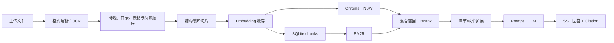
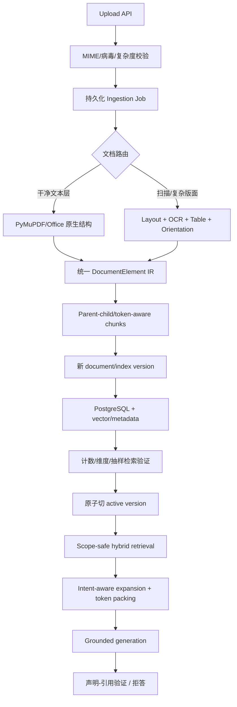

# RAG 系统全面审计与优化报告

> 审计日期：2026-08-16  
> 审计对象：`E:\GPT-Codex\LangChainRAG`  
> 审计方法：全仓源码/配置/脚本/测试/文档静态审查 + 真实 PDF 视觉抽查 + SQLite/Chroma 只读一致性检查 + 历史问答案例复核 + 前端生产构建  
> 结论口径：把“代码设计意图”“静态可推断行为”“本机实测结果”严格区分

## 1. 执行摘要

### 1.1 一句话结论

这是一套**明显优于普通教程或玩具 Demo 的 RAG 内部 Alpha**：主流程完整、引用与会话产品化程度较好，也积累了不少真实问题驱动的工程经验；但它当前**不具备公网生产上线条件**，尤其不应以“企业级”对外承诺。

最关键的判断是：你的直觉基本正确——**文件解析先损坏了结构，切片器随后把这种损坏放大；第二种 LLM 增强策略处在错误的层级上，因此很难根治。** 对扫描规范、旋转表格、Excel 台账而言，当前缺的不是更多正则或让 LLM 再判断一次编号，而是可靠的版面、方向、表格和阅读顺序恢复。

此外，还有四类比“回答偶尔不准”更危险的系统性错误：

1. 点名文档、章节扩展可能跨知识库取数，存在内容污染乃至数据隔离风险。
2. 文档重解析先删旧 chunk 并提交，再全量重建 Chroma；失败或并发时可能丢旧数据、出现空窗和索引竞态。
3. 全局唯一 `content_hash` 会让第二份文档中的相同条款直接消失，同时文档计数仍写切片前数量。
4. 语义缓存没有会话历史/用户/知识库版本隔离，短追问可能在不同语境中重放旧答案。

### 1.2 成熟度评分

| 维度 | 评分 | 结论 |
|---|---:|---|
| 功能完整度 | 7.5/10 | 上传、入库、问答、引用、会话、RBAC、管理 UI 均已形成闭环 |
| 文件解析/OCR | 4.0/10 | 文本层简单 PDF 尚可；扫描件、旋转页、表格、复杂 Word/Excel 保真不足 |
| 切片策略 | 4.5/10 | 有结构意识，但依赖被破坏的上游结构，真实长度和章节路径失控 |
| 索引与检索 | 5.0/10 | 混合召回和 rerank 思路好；隔离、扩展、分数校准、增量索引有严重缺陷 |
| 生成、引用与缓存 | 4.5/10 | SSE 与引用产品体验好；弱证据仍生成、引用仅靠 prompt、缓存作用域错误 |
| 架构与可维护性 | 5.5/10 | 模块边界清楚；事务、任务队列、迁移、配置/文档漂移不足 |
| 安全、部署与运维 | 3.0/10 | 默认凭据、JWT、代理限流、上传防护、Docker、readiness 均未达到生产要求 |
| 测试与评测 | 5.5/10 | 约 239 个测试函数很可贵；但未测真实语义质量、并发/恢复和前端关键竞态 |
| **原型综合成熟度** | **5.4/10** | **强原型/内部 Alpha** |
| **生产就绪度** | **3.2/10** | **No-Go，上线前需先完成 P0** |

评分低于旧报告的 7.2/10，不是因为代码退步，而是本次加入了**真实存量 chunk、真实历史问答和真实扫描 PDF**证据，发现设计看起来合理但数据上已经失败的路径。

### 1.3 上线结论

当前结论：**No-Go**。

可以用于：个人研究、毕业设计演示、受控内网小规模试用、构建评测集。  
不适合用于：公网开放、多人敏感知识库、工程安全决策、把回答作为规范/台账事实依据。

## 2. 审计范围与验证结果

### 2.1 覆盖范围

已阅读项目自有后端、前端、部署、脚本、测试、根文档和项目内 `.claude` 配置；第三方 `.venv`、`node_modules`、构建产物、二进制数据库/向量文件不逐行阅读，而是检查依赖声明、大小、元数据与一致性。运行数据仅做必要的只读统计与代表性问答案例复核，不在报告中复述个人信息。

### 2.2 实测结果

| 检查 | 结果 |
|---|---|
| 真实 PDF | 48 页，48/48 页无文字层，每页一张扫描图；末页图像横置 90°但 PDF Rotate=0 |
| 真实扫描文档存量切片 | 99 条，平均 502.8 字，最短 11、最长 2402；21 条 <100，15 条 >900 |
| DB/Chroma 当前一致性 | 1242 DB chunks = 1242 Chroma embeddings，当前快照一致 |
| 文档计数 | 文档 3 声称 100 chunks，实际 99，已出现统计漂移 |
| Chroma 磁盘 | 1 个当前 collection，但残留 25 个旧 HNSW 目录，约 59.2MB |
| 前端 | 绕过项目 shell 配置后 TypeScript 检查和 Vite production build 成功；3697 modules，构建约 32.25s |
| 后端 pytest | 未运行：仓库 `.venv` 绑定已不存在的本机 Python 3.10.11；这是环境可复现性缺陷，不计为测试失败 |

### 2.3 当前数据流

当前主要失真链是：`扫描/表格结构丢失 → 短单元格被误判为标题 → section 路径爆炸 → 巨大且重复的 chunk → 召回只命中部分行 → LLM 猜字段或补全集合 → 高相关度标签掩盖事实错误`。

## 3. 做得好的地方

这些部分值得保留，不建议推倒重来：

1. **产品闭环完整。** 上传、后台入库、进度、切片查看、检索预览、问答、SSE、引用卡片、历史、反馈、账号和管理员页面已经串通。
2. **模块边界清楚。** `DocumentParser`、chunker、embedding、vector store、BM25、RAG、chat、cache/memory 基本解耦，方便逐层替换。
3. **PDF 路由有质量意识。** 文字层/OCR 分流、CID/乱码启发式、目录提取、断号检查、OCR 修复内容量守卫，说明作者确实针对真实文档排查过问题。
4. **第二策略约束 LLM 的方向正确。** 它先生成确定性候选，再让 LLM 筛选，并禁止 LLM 自造编号，比“把整篇文档交给 LLM 自由切”可靠得多。
5. **混合检索思路合理。** 向量 + 按 KB 归一化 BM25 + cross-encoder rerank，比单纯向量检索更适合编号、术语和规范条文。
6. **SSE 错误体验较成熟。** 用户问题先落库，错误可转为前端事件，失败答案不进入正常缓存，明显优于常见原型。
7. **权限边界已有基础。** 用户会话按所有者隔离，管理员路由有后端检查，非所有者返回 404。
8. **测试数量可观。** 当前约 239 个 test functions，覆盖解析辅助、TOC/outline/gap、RBAC、会话、缓存、记忆和 SSE 等大量逻辑。
9. **工程复盘习惯好。** `docs/PROJECT_RECORD.md` 记录症状、根因、修复与代价，是项目很有价值的资产；下一步需要解决它与实现持续漂移的问题。

## 4. P0：上线前必须修复

### P0-1 跨知识库检索污染/数据隔离破坏

- `resolve_documents_by_title()` 全表扫描 Document，不接受 `kb_id`：`backend/app/services/rag.py:124-132`。
- `retrieve()` 一旦有 `doc_ids`，向量过滤只看 doc_id，不再强制当前 kb：`rag.py:417-455`。
- 章节与枚举扩展全表读取 Chunk/Document，再按同名 section 聚合：`rag.py:193`、`rag.py:282`。

影响：选择 A 库并点名/询问某章时，可能混入 B 库的同名文档或章节；在不同部门/租户知识库中属于潜在数据泄露。

修复：所有检索/扩展函数显式传递一个不可绕过的 `RetrievalScope(kb_ids, doc_ids, user/tenant)`；SQL、Chroma metadata、BM25 三路都使用同一个 scope；增加“两个 KB 同名文档/同名章节绝不串库”的集成测试。

### P0-2 入库与重建非原子，失败会丢旧数据

- 重解析先删除旧 Chunk 并立即 commit：`backend/app/modules/ingestion/manager.py:209-212`。
- 写锁只包 DB 写入，随后在锁外 `_rebuild_chroma()`：`manager.py:209-261`。
- 每次入库 reset 全集合并重加所有向量：`manager.py:264-290`、`backend/app/services/vector_store.py:62`。

影响：embedding/API/磁盘在中途失败时，旧可用版本已经被删；并发任务可交叉 reset/add，在线查询会遇到空/半成品索引。历史脚本中关于 HNSW 损坏的处理，很可能是这个设计的症状。

修复：引入 `document_version/index_version`；新版本写入临时/新 collection，验证 DB 数量、维度、抽样 query 后原子切 active version，再异步清旧版。不要对单文档更新做全库 reset。入库任务使用持久队列、幂等 job id、租约和重试。

### P0-3 全局内容去重破坏来源和计数

- `Chunk.content_hash` 全局 unique：`backend/app/db/models.py:183-191`。
- 入库查询全表已有 hash 并跳过：`manager.py:214-226`。
- `doc.chunk_count` 却仍写切片前数量：`manager.py:193`。

影响：两份规范复用相同条款、模板或声明时，第二份文档的片段消失，无法从第二来源引用；现有数据库已出现 `100 → 99` 的计数漂移。

修复：chunk 的身份使用 `(doc_version_id, chunk_index)`；允许相同文本多来源存在。只在 embedding cache 层按 `(model_version, normalized_content_hash)` 复用向量。

### P0-4 重解析会删除历史引用

`Citation.chunk_id` 对 Chunk 使用 `ON DELETE CASCADE`：`backend/app/db/models.py:199-203`。重解析/删 chunk 后，过去回答的引用记录一起消失。

修复：Citation 存不可变引用快照（source、page、section、snippet、document_version、content_hash），`chunk_id` 仅作可空弱关联并用 `SET NULL`；历史问答不能依赖可重建索引对象的生命周期。

### P0-5 弱证据仍允许生成，且引用纪律没有真正执行

- 主问答仅对部分“实时问题 + 弱证据”拒答：`backend/app/modules/qa/routes.py:220-246`。
- `verify_citations()` 虽已实现，却没有在主问答链路调用：`backend/app/services/verify.py:139`。
- 当前测试错误地把“今天这个水库的水位”认定为非实时：`backend/tests/test_api.py:1034-1056`。

历史数据已出现 evidence=none、top score 约 0.0004 时仍输出看似完整的敏感表格。这不是理论风险，而是已经发生的幻觉。

修复：

- 区分 `chat/general` 与 `knowledge-grounded` 模式；知识问答在无证据时必须拒答或明确“无法从资料确认”。
- 对日期、数值、姓名、联系方式、条款号等高风险声明做逐声明引用校验。
- 生成后检查引用编号范围、被引用内容是否支持声明；失败时不应把原答案标为 complete。
- 实时水情、调度状态、天气、现行法规等需要明确外部数据源或拒答。

### P0-6 安全默认值可直接接管系统

- JWT 默认 secret：`backend/app/core/config.py:39`。
- 默认管理员 `admin/123456`：`config.py:42-43`，首启自动创建：`backend/app/main.py:37-48`。

修复：生产模式下未设置强 secret/admin 初始化令牌即启动失败；取消固定默认密码；JWT 加 `iat/jti/iss/aud`、短 access token、refresh rotation、服务端 session version/吊销；改密和禁用用户立即使旧 token 失效。

## 5. 文件解析与 OCR 专项评估

### 5.1 当前方案的真实能力边界

| 类型 | 当前能力 | 主要损失 |
|---|---|---|
| 文本层 PDF | PyMuPDF 块/字号 + `find_tables` | 多栏顺序、跨块段落、表格在正文中的位置、脚注/图注 |
| 扫描 PDF | 300dpi + RapidOCR 条带 | 页面方向、版面区域、表格单元格、公式、多栏阅读顺序 |
| DOCX | 段落、英文 Heading N、表格 | 中文标题样式、编号 XML、页眉页脚、文本框、图片 OCR、脚注 |
| Markdown | 逐行标题/段落 | 代码块、列表、表格、跨行语义块 |
| XLSX | sheet + 每行扁平文本 | 合并单元格、多行表头、列类型、公式、隐藏行列、表间关系 |
| CSV | UTF-8-sig + `csv.reader` | 编码/分隔符探测、schema/类型、超长字段治理 |

### 5.2 已确认的解析错误

1. `_page_needs_ocr()` 把“常用中文占比低”作为 OCR 条件：`backend/app/services/parser/pdf.py:160-175`。英文页、数字表、公式页可能已有优质文字层却被强制 OCR。
2. OCR 合并只按 y/x 排序：`backend/app/services/parser/ocr.py:93-108`，不理解多栏和旋转页；合并后还把置信度硬写为 1.0：`ocr.py:107`。
3. 文字层表格先从正文块排除，再统一追加页尾：`pdf.py:438-503`，破坏原始阅读顺序。
4. `garble_ratio` 初始化为 0 后未写入真实统计：`pdf.py:202`；管理 UI 展示的 0 没有意义。
5. 主 parse 的 `doc.close()/clear_progress()` 不在 finally：`pdf.py:194-312`；异常可残留句柄/进度。
6. “Paddle 模式=PP-Structure”属于错误说明。代码只实例化 `PaddleOCR`：`backend/app/services/parser/ocr.py:44-47`，没有 PP-Structure 的布局、表格、公式与阅读顺序能力。

### 5.3 真实扫描样例的结论

48 页样例是非常好的压力样本：纯扫描、密集编号、表格、横置页并存。当前库对它报告平均 OCR 置信度 0.951、乱码率 0，但末页实际产生多个 2000+ 字的高度重复 chunk，section 被大量表格单元格文本拼成超长路径，并出现 OCR 错字。

因此，当前“高置信度 + 0 乱码 + 页覆盖”只能说明 OCR 引擎吐出了字符，**不能说明结构正确、字段对应正确或可用于问答**。

### 5.4 推荐的解析架构

不要立刻押注单一工具。用 20–30 份代表性文档做 bake-off：

1. **快速/原生通道**：文本层干净、单栏 PDF 继续用 PyMuPDF，但显式保存 bbox、block order、heading level、page rotation。
2. **复杂 PDF 通道**：比较 MinerU、Docling、PaddleOCR PP-StructureV3；它们官方均提供布局、表格/阅读顺序或扫描 OCR 能力。MinerU强调复杂布局和 Markdown/JSON，Docling支持 OCR/布局/表格结构，PP-StructureV3明确支持方向、阅读顺序、表格/公式/图表。参见 [MinerU](https://github.com/opendatalab/MinerU)、[Docling](https://docling-project.github.io/docling/)、[PP-StructureV3](https://www.paddleocr.ai/main/en/version3.x/algorithm/PP-StructureV3/PP-StructureV3.html)。
3. **备选基线**：Unstructured 提供 fast/hi_res/ocr_only 策略，但官方也说明 hi_res 对多栏排序有局限，必须用自己的中文样本评测，不能只看宣传。[官方说明](https://docs.unstructured.io/open-source/core-functionality/partitioning)
4. **统一中间表示**：输出 `DocumentElement{id,type,text,bbox,page,reading_order,heading_level,section_path,table_html,parent_id,confidence}`，chunker 只消费该结构，不再猜标题层级。
5. **旋转/倾斜预处理**：读取 PDF rotate + 图像方向分类；必要时 deskew/unwarp；对表格区域单独做结构识别，禁止横向条带切割表格。

建议首轮优先测试：**PP-StructureV3 与 MinerU**。原因不是它们必然最好，而是当前样本主要是中文扫描规范和复杂表格；Docling作为跨格式和结构化中间表示的强对照组。

## 6. 两种切片策略评估

### 6.1 经典策略

经典策略的优点是成本低、可解释、对格式规范的单栏文本有效；标题硬边界、章节前缀、表格独立块也符合领域需要。

但实际行为与配置直觉不一致：

- `chunk_size` 是字符数，不是目标模型 tokenizer 的 token 数：`backend/app/services/chunker.py:83-90`。
- 单块允许到 1.5×阈值：`chunker.py:135-143`、`213-216`。
- `chunk_overlap` 只对送入 Recursive splitter 的超长字符串生效；正常标题/page/buffer flush 没有重叠。
- 强制按页 flush：`chunker.py:174-175`、`200-201`，跨页段落/条款会断开。
- `merge_tiny_chunks()` 可把上一页小块并入下一页，却只保留后一页 page：`chunker.py:229-252`，引用页码可能失真。
- ParsedBlock 没有稳定的 `heading_level/section_path`，chunker 用 `parser_mode` 二次猜测：`chunker.py:107-126`。

真实扫描样例最短 11、最长 2402，说明这套策略在困难输入上并未形成可控切片。

### 6.2 “目录 + LLM 补全”策略

正确之处：目录作为权威骨架、确定性候选、LLM 只能筛选不能创造编号，这比端到端 LLM 切片稳健。

效果不佳的根因：

1. **修错层级。** LLM 只判断编号是否缺失，无法恢复旋转页、表格行列、多栏阅读顺序或 OCR 错字。
2. **降级策略危险。** LLM 调用失败时把全部候选视为 confirmed：`backend/app/modules/ingestion/manager.py:145-148`，合法跳号/正文数字可能被注入成边界。
3. **没有同文档 A/B。** 当前数据只有一份 `new` 文档，且是 59 页、0 OCR 页的文本层 PDF；困难扫描样例仍是 old。不同文档的 chunk 数和问答效果不可比较。
4. **缺少目标函数。** 没有边界 gold、Recall@k、answer correctness 或单位成本，无法判断多一次 LLM 是否产生净收益。
5. **完整性守卫太弱。** `completeness.py` 主要检查短行是否仍出现在 chunks，长行可跳过；页覆盖无法发现列错位和表格结构丢失。

### 6.3 推荐的新切片方案

不要继续增加一个“第三种神奇切片器”。先固定中间结构，再采用分层索引：

- **原子元素层**：段落、列表项、条款、表格行/表格、图注；保留 page+bbox+parent。
- **检索子块层**：按 tokenizer 约 250–500 tokens，优先在段落/条款边界切；相邻文本可有 10%–15% overlap，但表格按 schema/行组处理。
- **父块层**：完整小节或表格，约 800–1600 tokens；子块命中后返回父块/相邻块供生成。
- **标题上下文**：作为 metadata 和可控前缀保存，不能反复拼接成正文，也不参与内容唯一性。
- **表格双表示**：保留 HTML/JSON 结构，同时生成“列名: 值”的逐行检索文本；Excel 问答优先走结构化查询或 dataframe/SQL 工具，而不是只靠向量。
- **跨页连续性**：用 bbox、句尾、条款号、页眉页脚判断跨页连接；引用保存 page_start/page_end，而不是强制单页。

LLM 更适合离线做“结构异常审查/候选边界复核”，不应位于每次入库的决定性主路径；默认失败应“不注入”，并记录待人工检查。

## 7. Embedding、索引、检索与重排

### 7.1 Embedding 与缓存

优点：批量 embedding、文档向量 DB 缓存、查询 LRU、模型抽象都合理。

问题：

- `EmbeddingCache.content_hash` 单列主键，但查询同时按 `model_version`：`backend/app/db/models.py:225-226`、`backend/app/services/embedding.py:133-158`。换模型后相同 hash 无法插入新版本，形成永久 cache miss/主键冲突逻辑。
- 查询 LRU 只把 `embedding_model + text` 作为 key：`embedding.py:101-109`，没有 provider/base URL/query instruction/维度/索引版本。
- 没有显式向量维度校验、调用时延/批次/重试/费用指标。
- 当前 embedding cache 2971 条、chunks 1242 条，SQLite 已约 76.5MB；需要 TTL/容量/版本清理。

修复：主键改为 `(embedding_model_version, content_hash)`；模型版本应包含 provider、模型、维度、normalize、query/doc instruction；索引也绑定同一版本并在写入前校验维度。

### 7.2 Chroma 与索引生命周期

当前 1242 条规模，Chroma 本身不是瓶颈；**使用方式**才是瓶颈。

- 只锁初始化，不锁 reset/add/query：`backend/app/services/vector_store.py`。
- 每文档全库重建形成累计近似 O(N²) 的写放大。
- 现有目录已残留 25 代 HNSW 文件，说明 reset 生命周期存在实际磁盘副作用。
- 查询期间没有 active index version/readiness，无法知道读到哪一代。

短期可继续使用 Chroma，但要改成稳定 collection + 按 ids 增删，或版本化 collection 原子切换。中长期若需要多人、审计、事务和 metadata filtering，优先评估 PostgreSQL + pgvector，把 chunk、权限、版本和向量放在同一事务域；pgvector 官方支持 HNSW/IVFFlat、混合全文检索和精确召回对照，但同样需要基于数据调 `ef_search` 并监控 ANN recall。[官方文档](https://github.com/pgvector/pgvector)

不要因为“未来可能百万级”立即换 Milvus/Qdrant。先解决版本化、隔离和评测；在 1242 条规模换库不会提升答案质量。

### 7.3 BM25、融合与 rerank

优点：中文 jieba + BM25 对条款号、术语和文件名有效；按 KB 归一化有价值；cross-encoder rerank 能修正向量排序。

问题：

- 文档仍写 RRF，代码实际是线性加权；`top_k_rrf` 也是死/误名配置。
- BM25 无领域词典、停用词、字段权重、持久化和增量更新；启动全量重建。
- rerank 网络请求缺乏端到端预算；100 候选会显著增加延迟和费用。
- `min_content_len` 在最终 hydrate 后才过滤且不回补，可能返回不足 top_k。
- 向量/BM25融合分数和 reranker 分数不在同一标度，却共用 evidence 阈值：`backend/app/services/rag.py:325-344`。
- 章节扩展先于枚举扩展：`rag.py:513-518`；一旦前者命中，集合问题可能只取最多 15 个，而不是完整列表。
- 章节相关性按候选分数求和，天然偏向 chunk 多的大章节；成员查询无稳定 order 后先截断再 rerank。
- `retrieve_document_wide()` 只取 top1 所属文档和前 60 chunks，不适合多文档对比或超长完整列表。

建议：

1. 用 RRF 或经训练/校准的融合，而不是手工把不可比分数相加后解释为置信度。
2. 检索先返回候选元素，随后做 diversity/MMR、邻接合并和 token budget packing。
3. “全部/清单/名单/有哪些”走专门的 exhaustive intent：限定文档/章节后按原始顺序分页拉全，不依赖 top-k 近邻。
4. 数值/表格问题走结构化路径；比较题允许多文档且保留每条事实的来源。
5. evidence 至少分开记录 `retrieval_score_type`、top-k coverage、rerank score，并在标注集上校准；不要把当前四级分布称为“反幻觉准确率”。

## 8. 生成、引用、缓存与记忆

### 8.1 Prompt 与上下文

`build_messages()` 同时把历史作为独立 Human/AI messages，又写入当前 human 的【对话历史】：`backend/app/services/chat.py:153-201`，浪费 token 并放大历史影响。当前 prompt 还要求“相关条目全部列出”，但上下文本身常只有 top-k，形成不可能完成的指令。

修复：历史只保留一种表达；检索上下文按 token 预算、去重和相邻块合并；向模型明确“你看到的是候选证据，不代表文档全集”。集合题必须先由检索层保证完整性。

### 8.2 语义缓存

当前 cache 按 kb/doc_scope/style 隔离，但没有 user、conversation/history、rewritten query、文档版本、prompt/model version、TTL：`backend/app/services/semantic_cache.py:62-148`。

尤其危险的是：检索使用改写后的 `search_query`，缓存向量却来自原始 `body.content`：`backend/app/modules/qa/routes.py:138-158`、`264-265`。像“还有呢”“做成表格”这样的短追问可在另一段历史里命中并重放带旧语境答案。

修复：默认关闭上下文追问的 semantic cache；cache key 至少包括 `tenant/user? + kb/index_version + normalized rewritten query + conversation context hash + style + prompt/model version`。更安全的第一阶段只缓存明确独立、非敏感、无历史的查询。

### 8.3 引用与完备性

当前 Citation 数据模型和前端展示很好，但“引用正确”主要靠 prompt。完备性 verifier 只看到引用元数据而不是每条引用内容/gold，无法可靠判断是否覆盖全部；第二轮重生成后也没有再次验证最终答案。

建议将质量拆成三个可验证问题：

- **引用有效性**：引用编号存在，source/page/version 可回溯。
- **引用蕴含**：每个事实声明是否被引用片段支持。
- **覆盖完整性**：gold facts/目标表格行是否都被召回并回答。

### 8.4 记忆

按用户、KB、doc_scope/style 隔离以及 good/bad 行为是正向设计。但取消反馈只清 Message.feedback，不撤销已沉淀 memory；重解析后 memory/cached citations 的旧 chunk_id 可能失效。记忆内容也需要知识库版本与可撤销 lineage。

## 9. 架构、数据一致性与任务系统

### 9.1 后台任务

`asyncio.create_task()` 只存在单进程内：`backend/app/modules/ingestion/manager.py:45`。重启、多 worker、进程崩溃后任务和进度丢失，文档可能永久停在 parsing/embedding/indexing。

建议最少实现数据库 job 表：`queued/running/succeeded/failed/cancelled`、attempt、lease_until、heartbeat、input/version、error、progress；独立 worker 拉取并幂等执行。规模更大时再用 Celery/RQ/Arq/Temporal，不必一开始过度复杂。

### 9.2 数据库与迁移

SQLite 对个人/小团队读多写少可以接受，但不是当前“企业级多用户 + 后台写任务”的可靠基础。`init_db()` 对所有方言无条件使用 PRAGMA 和 SQLite ALTER：`backend/app/db/session.py:93-172`，所以“只改连接串即可迁移 PG/MySQL”不成立。

修复：引入 Alembic；生产改 PostgreSQL；为 document_version、ingestion_job、index_version、retrieval_trace 建正式 schema。SQLite 仅保留开发/单机模式。

### 9.3 可观测性

当前日志有一些关键异常，但 `/api/health` 只返回常量：`backend/app/main.py:148-149`；全局未捕获异常 handler 没有记录异常：`backend/app/core/exceptions.py:39`。

需要：

- liveness 与 readiness 分离；readiness 检查 DB、active index、worker backlog、模型依赖。
- 每次问答记录 trace_id、index_version、rewrite、候选 ids/scores、rerank、packed context、model、tokens、latency、finish reason。
- 入库分 stage 记录页数、OCR/布局耗时、失败页、内存峰值、chunk 分布、索引写入数量。
- 监控 P50/P95/P99、错误率、队列时长、cache hit、ANN recall 抽检和磁盘增长。

## 10. 安全、部署与前端

### 10.1 其他安全问题

- slowapi 实际用 `get_remote_address()`：`backend/app/core/ratelimit.py:6-23`；在 Nginx 后可能把所有用户视为代理 IP。必须配置可信代理链，不能无条件信任任意 X-Forwarded-For。
- 上传只看扩展和总字节：`backend/app/modules/knowledge/routes.py:110-127`；没有 magic/MIME、病毒、PDF/ZIP bomb、页数/像素/对象复杂度和租户配额。
- CSV 导出未防 `=,+,-,@` 公式注入：`backend/app/modules/memory/routes.py:150-190`。
- token 存 localStorage：`frontend/src/stores/auth.ts:13-24`；XSS 时可直接被窃取。ReactMarkdown 当前未启用 raw HTML 是正向点，但仍应配置 CSP。
- 调试转储包含真实问答和文档个人信息；应脱敏、限制权限、设置保留期，不得随备份无限保存。

### 10.2 Docker/依赖

- compose `build: ..`：`deploy/docker-compose.yml:7`，但 Dockerfile 位于 `deploy/Dockerfile`，默认构建路径预计失败。
- Dockerfile 依赖预先存在的 `frontend/dist`：`deploy/Dockerfile:19`，不是可复现多阶段构建。
- 无 non-root、healthcheck、restart、资源限制和持久化备份策略。
- 后端 requirements 全是宽松 `>=` 且没有 lock/hash；RapidOCR/onnxruntime/Paddle 也未明确声明。
- 仓库 `.venv` 指向已不存在的本机 Python，前端 `.npmrc` 又硬编码 Git Bash 路径；两者都证明环境没有真正可复现。

建议用 multi-stage Docker/uv 或 pip-tools 锁定；镜像内完成前端 build；运行 non-root；明确 CPU/GPU OCR 镜像；CI 从零构建并跑测试。

### 10.3 前端

优点：React strict TypeScript、TanStack Query/Zustand 分工清楚，引用/解析质量/切片/检索预览对调试很有帮助。

关键问题：

- 流式期间仍可切换/删除会话，SSE 回调总改全局最后消息：`frontend/src/stores/chat.ts:78`、`121-232`，旧流会显示到新会话。
- SSE JSON 解析失败被静默吞掉，尾部 buffer 不处理；fetch 绕过 axios 401 逻辑：`frontend/src/api/modules.ts:96-167`。
- 管理页固定取前 100 文档且无分页：`frontend/src/pages/KnowledgeBase.tsx:199`。
- 输入 searchQ 即自动发请求，按钮并不控制提交：`KnowledgeBase.tsx:277-281`。
- 多文件上传只有一个 pending，无逐文件进度/取消/失败重试：`KnowledgeBase.tsx:535-549`。
- App 静态 import 所有页面，没有文档宣称的路由懒加载：`frontend/src/App.tsx:1-8`。
- build 主要包 gzip 合计已超过 580KB，AntD 单 chunk gzip 约 313KB；管理员页面应 lazy load。
- 粒子/aurora 没有 `prefers-reduced-motion`，低端设备和无障碍体验不足。
- 无 Vitest/React Testing Library/Playwright、lint/format 脚本。

修复流状态时，为每个请求生成 requestId，事件携带 conversationId/requestId/messageLocalId；切换/删除先 abort；store 只更新匹配对象，不使用“最后一条消息”隐式定位。

## 11. 技术栈选型结论

| 技术 | 当前判断 | 建议 |
|---|---|---|
| FastAPI + async SQLAlchemy | 合适 | 保留；补正式迁移、任务 worker、可观测性 |
| React + TypeScript + AntD | 合适 | 保留；路由懒加载、前端测试、移动/无障碍优化 |
| LangChain/LCEL | 可用但价值有限 | 保留薄封装；避免把业务状态隐藏在 chain 中，不必为“更高级”急着上 LangGraph |
| DeepSeek/OpenAI-compatible API | 原型合适 | 加模型/version trace、超时预算、数据出境/隐私策略；高风险任务需严格 grounded |
| BGE-M3 + reranker | 合理起点 | 用领域评测集比较模型，不因个别成功案例固定 100 candidates |
| RapidOCR | 仅适合作为 OCR 字符基线 | 不能承担布局/表格/旋转结构；接版面解析器 |
| PyMuPDF | 适合快速文本层路径 | 保留，但输出 bbox/reading order；复杂页路由到模型管线 |
| SQLite | 仅开发/个人单机 | 多用户生产换 PostgreSQL |
| Chroma embedded | 当前规模可用 | 短期修增量/版本；生产是否换 pgvector/Qdrant由隔离、运维和规模决定 |
| BM25 + jieba | 合理轻量基线 | 加领域词典、字段权重、增量与评测；也可迁到 PG FTS/专门搜索引擎 |
| 自研语义缓存/记忆 | 产品想法好，当前风险高 | 缩小适用范围，补版本、lineage、撤销和隐私隔离 |

“LangGraph、多 Agent、知识图谱”不是当前优先级。上游数据不可信时，增加 Agent 步骤只会更慢、更贵，并让错误更难定位。先把解析、检索、引用和评测做成确定性、可回归的基础设施。

## 12. 测试与质量评测

### 12.1 现有测试评价

静态计数约 239 个测试函数，其中 API 集成 48 个，其余覆盖 parser/chunker/TOC/outline/gap/cache/memory/security/RAG。数量与针对历史 bug 的回归意识都值得肯定。

但它们主要验证“代码路径能跑”和“规则按预期触发”，没有证明 RAG 准确：

- FakeEmbedding 是哈希/伪向量，不能验证语义召回。
- FakeLLM 固定回答，不能验证 grounded generation 或引用正确性。
- PDF 样本缺失时测试直接 return，不会失败：`backend/tests/unit/test_pdf_parser.py:16`。
- 无 OCR CER/WER、reading order、表格结构、标题层级或 golden extraction 快照。
- 无跨 KB 同名文档/章节、重复条款、重建中断、并发入库、stale citation/cache、恶意上传测试。
- 无前端快速切会话、SSE 半包/错误包、断网、移动端或 E2E 测试。
- 无真实 embedding/rerank 小型回归集、延迟/并发/内存/成本基准。

### 12.2 建立四层评测集

建议先做 30 份文档、100–150 个问题，而不是追求海量：

1. **解析层**
   - 文本：CER/WER、关键数字/条款号准确率。
   - 结构：标题层级 F1、reading-order edit distance、页/块顺序。
   - 表格：cell precision/recall、row/column alignment、合并单元格、数值字段准确率；可采用 TEDS 一类结构指标。
   - 样本必须含：文本层、扫描、混合、横置/倾斜、多栏、复杂表格、DOCX 中文标题、XLSX 合并表头。
2. **切片层**
   - gold 事实是否完整落在某个子块/父块中。
   - chunk token 分布、<最小/超最大比例、冗余率、跨页错引率、section path 准确率。
3. **检索层**
   - Recall@5/10/20、MRR、nDCG@10、context precision。
   - 单事实、精确条款、同义问法、集合完整、跨文档比较、否定/无答案、点名文档和跨库隔离分别统计。
4. **回答层**
   - factual correctness、faithfulness、citation precision/recall、集合覆盖率、拒答正确率。
   - 自动指标只作筛选，最终用人工标注校准。Ragas 官方提供 context precision/recall、faithfulness 等维度，但不能替代领域人工 gold。[指标说明](https://docs.ragas.io/en/stable/concepts/metrics/available_metrics/)

### 12.3 第一版验收门槛

以下不是行业通用真理，而是建议的首个 release gate：

- 跨 KB 泄露测试：0 次。
- 关键数字/日期/姓名问题：citation-supported factual accuracy ≥ 95%。
- 无答案/实时问题拒答准确率 ≥ 95%。
- 检索 Recall@10 ≥ 90%，集合题 row recall ≥ 95%。
- 引用 precision ≥ 95%，引用页/表/行可复核率 ≥ 95%。
- 扫描规范关键条款 OCR 字符准确率 ≥ 98%；关键编号准确率 ≥ 99%。
- 表格关键字段映射准确率 ≥ 98%，旋转页自动纠正率 100%（在评测集内）。
- 入库故障注入后旧版本仍可查询；DB/active index count 一致率 100%。
- P95 首 token、总响应、入库页耗时和峰值内存需先测基线，再设 SLO；没有基线前不要写“企业级性能”。

## 13. 分阶段优化路线图

### 阶段 0：立即止血（1–3 天）

1. 禁止公网部署；生产模式移除默认 admin/secret。
2. 默认关闭或严格限制 semantic cache；无/弱证据的知识问答改为拒答。
3. 修复 KB/doc scope，覆盖所有 retrieve/expand/document-wide 路径。
4. 停止单文档入库时全库 reset；至少把所有写入串行并在失败时保留旧 chunk/index。
5. 修正“今日水位”实时分类和对应测试。
6. 删除/隔离含个人信息的 debug dump，建立日志脱敏和保留策略。

### 阶段 1：数据正确性（1–2 周）

1. 迁移 chunk identity/global hash、Citation snapshot、embedding cache 复合键。
2. 加 document/index version 和持久 ingestion job；完成幂等、重试、取消、恢复。
3. Excel 建 schema-aware parser；至少保留 header path、cell coordinate、row JSON，并为列表/日期查询走结构化路径。
4. PDF 加 orientation/deskew，禁止表格走条带 OCR；修真实 garble/quality 指标。
5. 建立 20–30 文档解析 golden set 和首批 50–80 QA gold。

### 阶段 2：解析与切片升级（2–5 周）

1. 用同一批样本对比 PyMuPDF、PP-StructureV3、MinerU、Docling，记录准确率、P95、内存、GPU/CPU 成本。
2. 落地统一 DocumentElement 中间表示。
3. 改为 tokenizer-aware parent-child chunking；表格双表示；跨页范围引用。
4. 同一文档 old/new/new-layout 三路配对入库，冻结 embedding/rerank 配置做 A/B。

### 阶段 3：检索与回答质量（3–6 周）

1. 实现 scope-safe hybrid retrieval、集合/比较/表格专用意图。
2. 做邻接合并、去冗余、token budget packing；在 gold 上调 fusion/top-k/rerank。
3. 上线逐声明引用校验、最终答案再验证和 grounded refusal。
4. 建持续评测仪表盘；每次解析/embedding/prompt/模型变更都跑回归。

### 阶段 4：生产工程（4–8 周）

1. PostgreSQL + Alembic；根据评测选择 pgvector 或独立向量服务。
2. 独立 worker、readiness、metrics/tracing、备份恢复和灾难演练。
3. 多阶段 Docker、依赖锁、非 root、资源限制、CI/CD、安全扫描。
4. 完善 JWT session、可信代理、上传沙箱/配额/病毒和内容复杂度限制。
5. 前端 requestId 隔离、lazy routes、逐文件任务 UI、Vitest/Playwright、CSP/无障碍。

## 14. 优先级问题清单

| 优先级 | 问题 | 影响 | 预计修复量 |
|---|---|---|---:|
| P0 | 跨 KB 文档/章节扩展污染 | 数据泄露、错误引用 | 中 |
| P0 | 重解析删除旧 chunk + 非原子全库重建 | 数据丢失、查询空窗、索引损坏 | 大 |
| P0 | 全局 hash 去重与计数漂移 | 来源丢失、引用错误 | 中/含迁移 |
| P0 | Citation 级联删除 | 历史审计记录消失 | 中/含迁移 |
| P0 | 弱证据继续生成且无引用校验 | 已发生真实幻觉 | 中 |
| P0 | 默认 secret/admin | 系统可被接管 | 小 |
| P1 | 语义缓存缺用户/历史/版本 | 跨语境重放、隐私风险 | 中 |
| P1 | PDF 无布局/方向/表格结构 | 扫描规范切片崩坏 | 大 |
| P1 | Excel 扁平化 | 日期/列字段错配 | 中 |
| P1 | 内存后台任务 | 重启丢任务、状态卡死 | 中 |
| P1 | SQLite-only 手写迁移 | 无法真正迁 PG、多写受限 | 大 |
| P1 | evidence 分数跨标度未校准 | 伪置信度、误导统计 | 中 |
| P1 | 上传仅扩展/大小校验 | 文件攻击与资源 DoS | 中 |
| P1 | JWT 无吊销、代理限流错误 | 账号/爆破风险 | 中 |
| P1 | 前端跨会话流竞态 | 错位显示、用户误判 | 小/中 |
| P2 | BM25/embedding cache 版本治理 | 索引漂移、磁盘增长 | 中 |
| P2 | 前端体积、无 lazy/test | 首屏慢、回归风险 | 中 |
| P2 | 文档与代码漂移 | 维护/答辩结论不可信 | 小但持续 |
| P2 | OCR/Chroma/debug 临时产物治理 | 磁盘和隐私风险 | 小 |

## 15. 推荐的下一版目标架构

## 16. 可后续增强的功能

以下能力有价值，但应排在 P0/P1 之后：

- 文档版本对比、变更条款提醒、失效规范标记。
- 表格自然语言查询、下载带来源的结构化结果。
- 规范引用关系图谱和术语词典；仅在结构化 extraction 可靠后建设。
- 多文档对比问答与冲突证据提示。
- 人工审核队列：低置信/高风险/集合不完整答案进入复核。
- 按用户/部门权限过滤 chunk，审计谁检索了什么。
- 反馈驱动评测集，而不是直接把点赞答案当作永久记忆。
- 模型/embedding/reranker 可切换实验面板和成本/质量对比。

## 17. 最终判断

### 哪些地方做得好

主链路完整、模块化合理、RAG 产品形态清晰；对 PDF、TOC、编号、rerank 和 SSE 的处理体现了真实迭代经验；测试与项目复盘习惯优于大多数 vibe coding 项目。

### 哪些地方需要优化

解析中间表示、token-aware parent-child chunk、可校准检索、结构化表格查询、持久任务、正式迁移、前端并发状态和评测体系。

### 哪些地方属于设计错误

全局 chunk hash 去重、重解析级联删除历史 Citation、先删旧数据再非原子全库重建、跨 KB 扩展无 scope、上下文无关的 semantic cache key、把不可比分数称为证据准确度、把普通 PaddleOCR 宣称为 PP-Structure、弱证据仍允许生成具体事实。

### 当前最值得做的三件事

1. **先修数据隔离与版本化入库，不再全库 reset。**
2. **用真实扫描 PDF/Excel 建 gold，比较版面解析器并落统一结构。**
3. **把“感觉回答不错”替换为可复现的检索、引用和事实正确率门禁。**

完成这三件事后，再讨论 LangGraph、Agent、知识图谱或更大模型，项目才会沿着正确方向增长。
